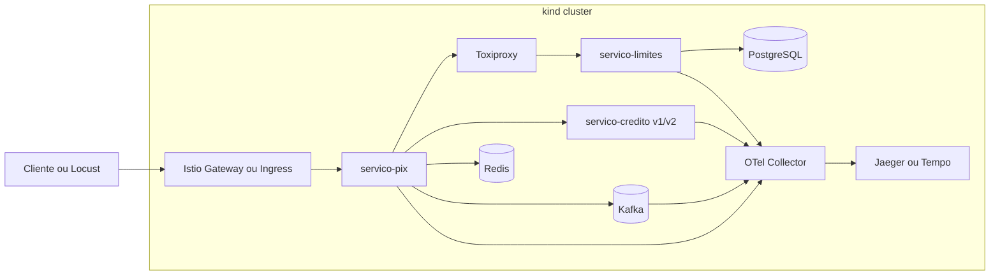

# Plano de estudo e laboratório — microsserviços financeiros

Documento de referência para estudar resiliência, observabilidade, malha de serviços, consistência transacional, **eventos com Apache Kafka**, entrega contínua e experiência do desenvolvedor em contexto bancário ou de pagamentos (ex.: *Pix*, limites, contas). Este repositório já inclui **apps Python de exemplo** em [`apps/`](apps/) para **engenheiros de cloud** focarem em ferramentas e plataforma. A [**espinha dorsal**](#espinha-dorsal) (seção *Espinha dorsal prática — do zero ao cenário integrado (kind)*) amarra os módulos num único monorepo e cluster **kind** até um *showcase* final. O [**Módulo 7**](#modulo-7) fecha o ciclo com operação segura, integridade de dados (filas, contratos, DR) e conformidade.

**Âncoras úteis**

- [Como usar este plano](#como-usar-plano)
- [Espinha dorsal](#espinha-dorsal)
  - [Ondas (Princípio)](#ondas-principio)
  - [Mapa módulos ↔ ondas](#mapa-modulos-ondas)
- [Kafka no plano (§2.5)](#estudo-kafka)
- Módulo [0 — Fundamentos](../modulos/modulo-00-fundamentos-distribuidos.md) (leitura antes da Onda 0)
- Módulos: [1](#modulo-1) · [2](#modulo-2) · [3](#modulo-3) · [4](#modulo-4) · [5](#modulo-5) · [6](#modulo-6) · [7](#modulo-7)
- [Referências](#referencias-estudo) · [Bibliografia ampliada](REFERENCIAS.md)
- [Roadmap de evolução](#roadmap-evolucao) · [Exercícios de falha](../labs/EXERCICIOS-FALHA-E-TROUBLESHOOTING.md)
- **Guias expandidos (conceitos):** pasta [`modulos/`](modulos/README.md)
- **Laboratórios passo a passo:** pasta [`labs/`](labs/README.md)

---

<a id="como-usar-plano"></a>

## Como usar este plano

| Aspecto | Sugestão |
|--------|----------|
| **Conhecimento (curso)** | [`ebook/PRE-REQUISITOS.md`](ebook/PRE-REQUISITOS.md) — HTTP, Docker, K8s, Python, SQL (não confundir com checklist de cada lab) |
| **Labs / ambiente** | Em cada [`labs/lab-*.md`](labs/README.md): seção *Antes de começar* (labs anteriores + ferramentas + RAM) |
| **Stack de laboratório** | Serviços em **Python** (ex.: **FastAPI** ou **Flask**), cliente HTTP **httpx** (sync ou async), opcional **grpcio** se usar gRPC nos labs |
| **Ritmo** | 1 módulo por semana (teoria 4–6 h + laboratório 4–8 h) |
| **Ambiente** | Cluster local com **[kind](https://kind.sigs.k8s.io/)** (recomendado para a **espinha dorsal** abaixo); **minikube** como alternativa |
| **Evidências** | Ao concluir cada laboratório, guarde prints ou exports: métricas, trace JSON, logs e notas do que observou |

### Conhecimento vs lab vs ambiente

- **Conhecimento do curso** → [`ebook/PRE-REQUISITOS.md`](ebook/PRE-REQUISITOS.md) (leitura única no início).
- **Lab anterior** → “já concluí Lab 00” (cluster ou Compose com *Pix*/*Limites*).
- **Ambiente** → Docker, *kind*, Helm, RAM livre (cada lab lista o que precisa *hoje*).

### Aplicação de referência (Python) neste repositório

Para **engenheiros de cloud**, o custo de “inventar microsserviço do zero” atrapalha o estudo de **kind**, **mesh**, **observabilidade** e **políticas**. Por isso este monorepo já traz:

- **`apps/servico-limites`** — `GET /v1/limits/{account_id}` (dados mock em memória).
- **`apps/servico-pix`** — `POST /v1/pix` chama limites com **httpx** + timeout; header `Idempotency-Key` ecoado; se `KAFKA_BOOTSTRAP_SERVERS` estiver definido, publica evento **`pix.iniciado`** no **Apache Kafka** (veja `docker-compose.yml`).
- **`apps/servico-credito`** — `GET /v1/score` com env **`SERVICE_VERSION`** para labs de canary.

**Infra pronta para subir:** [`docker-compose.yml`](docker-compose.yml), [`deploy/k8s/`](deploy/k8s/) (Kustomize) e [`scripts/build-load-kind.sh`](scripts/build-load-kind.sh). Detalhes de uso: [`README.md`](README.md) e [`apps/README.md`](apps/README.md).

**Filosofia:** o código permanece **pequeno e legível**; você adiciona Tenacity, pybreaker, OTel, Redis, Postgres, **Kafka** (consumidores, outbox relay), *Toxiproxy*, Istio, etc., conforme os módulos — sem precisar desenhar o domínio *Pix* / *Limites* do zero.

---

<a id="espinha-dorsal"></a>

## Espinha dorsal prática — do zero ao cenário integrado (kind)

Esta seção é a **linha contínua** do estudo: um único repositório e um único cluster **kind** que você faz evoluir **onda a onda**. Os **Módulos 1–6** aprofundam cada tema em paralelo ao código em [`apps/`](apps/). A tabela **Princípio** (Ondas **0–7**) descreve o que entra no cluster; a tabela **Mapa (módulos ↔ ondas)** logo abaixo liga cada módulo às ondas. Com isso você sabe **em que ordem** implementar no **kind** e **como fechar** com um *showcase* final (resiliência, métricas/traces, mesh, canary, GitOps leve, catálogo).

<a id="ondas-principio"></a>

### Princípio

| Onda | O que entra no cluster | Liga ao módulo |
|------|-------------------------|----------------|
| **0** | Cluster kind + imagens + `servico-pix` e `servico-limites` (REST, health, sem mesh) | Base para todos |
| **1** | *Toxiproxy* entre *Pix* e *Limites* (Deployment + Service); retries/breaker no Python | Módulo 1 |
| **2** | **Redis** (idempotência) + **PostgreSQL** (saldo / limites) + **Apache Kafka** (eventos `pix.iniciado` → workers; outbox relay no Módulo 7) | Módulos 2, 4 e 7 |
| **3** | **OpenTelemetry Collector** + **Jaeger** ou **Tempo** + Grafana (stack mínima de observabilidade) | Módulo 2 |
| **4** | **Istio** no kind; sidecars; **mTLS STRICT**; **AuthorizationPolicy** (só o *Pix* pode chamar *Limites*) | Módulo 3 |
| **5** | **`servico-credito`** (v1/v2); **VirtualService** canary + opcional mirror | Módulo 5 |
| **6** | **Argo CD** no kind *ou* pasta `deploy/` versionada + `kubectl apply -k` reproduzível (GitOps leve) | Módulo 5 |
| **7** | **`catalog-info.yaml`** (+ TechDocs opcional) descrevendo os serviços e o lab | Módulo 6 |

<a id="mapa-modulos-ondas"></a>

### Mapa (módulos ↔ ondas)

Use esta tabela para não perder o fio: cada **módulo** aprofunda teoria e laboratório; cada **onda** é o que você sobe no **kind** com o código em [`apps/`](apps/) e os manifests em [`deploy/`](deploy/).

| Módulo do plano | Onda(s) na espinha dorsal |
|-----------------|---------------------------|
| **1** — Resiliência e caos | **Onda 1**; práticas de retry/breaker aplicam-se ao *Pix* desde a **Onda 0** |
| **2** — Observabilidade | **Onda 3**; *Kafka* ([§2.5](#estudo-kafka)) e fila no lab “*Pix* perdido” ligam à **Onda 2** |
| **3** — Service mesh | **Onda 4** |
| **4** — Concorrência, idempotência, sagas | **Onda 2** (Redis, Postgres, eventos) |
| **5** — Deploy, canary, GitOps | **Onda 5** e **Onda 6** |
| **6** — Backstage | **Onda 7** |
| **7** — Operação e conformidade | Reforço transversal às **Ondas 2–6** (ver [§7.7](#modulo-7-encadeamento)); conclui o monorepo |

**Como ler:** você pode estudar os **Módulos 1–6** em ordem pedagógica *e* ir aplicando no **kind** seguindo as **Ondas 0–7**; o **Módulo 7** fecha o mesmo repositório com segurança operacional e auditoria.

### Estrutura de repositório sugerida (monorepo)

Organize para que cada onda seja um **merge** pequeno e testável.

```text
financial-applications/          # ou clone renomeado (ex.: banco-lab)
  apps/
    servico-pix/                   # já existe: FastAPI + httpx (estenda nos módulos)
    servico-limites/
    servico-credito/
  deploy/
    k8s/                           # Kustomize base (manifests já no repositório)
    kind/                          # cluster-config.yaml (adicione na sua trilha)
    istio/                         # PeerAuthentication, VirtualService, …
    kafka/                         # README: Kafka em kind (Strimzi / Helm)
    observability/                 # OTel Collector, Jaeger/Tempo, Grafana
    toxiproxy/
  scripts/
    build-load-kind.sh             # build :lab + kind load docker-image
  docker-compose.yml
  catalog-info.yaml                # Backstage Location + entities
  README.md
  PLANO_DE_ESTUDO.md
```

### kind — cluster base e imagens locais

1. Instale [kind](https://kind.sigs.k8s.io/docs/user/quick-start/) e `kubectl`.
2. Crie `deploy/kind/cluster-config.yaml` com `kind: Cluster`; **um nó** costuma bastar no notebook (dois nós se quiser estudar **taints** / **workers**).
3. **Portas no host:** em `nodes` com `role: control-plane`, use `extraPortMappings` para **80** e **443** e anote labels tipo `ingress-ready=true` se for usar **Ingress** ou **Istio Gateway** com NodePort mapeado para o host.
4. **Imagens no cluster:** após `docker build -t servico-pix:lab .`, use `kind load docker-image servico-pix:lab --name <nome-do-cluster>`. Para fluxo mais “de produção”, suba um [**registry local**](https://kind.sigs.k8s.io/docs/user/local-registry/) e use `docker push` com `imagePullPolicy: Always`.
5. **Namespaces sugeridos:** `core-banking` (apps), `istio-system`, `observability`, `argocd` (se usar Argo CD).

### Arquitetura alvo (visão única)



*(Se o Mermaid não renderizar: cliente → gateway → *Pix* → *Toxiproxy* → *Limites*; *Pix* também fala com *Crédito*, Redis, **Kafka** e exporta OTLP; *Limites* usa Postgres; Kafka/workers podem exportar traces; Collector → Jaeger/Tempo.)*

### Roteiro onda a onda (encadeamento mínimo)

**Onda 0 — “Banco mínimo”**

- `kind create cluster --config deploy/kind/cluster-config.yaml`
- Subir `servico-limites` e `servico-pix` (Deployment + Service); `LIMITES_URL` no *Pix* apontando para `http://servico-limites.core-banking.svc.cluster.local` (ajuste o nome do Service/namespace).
- Expor com `kubectl port-forward` ou Ingress/Gateway.
- **Pronto quando:** chamada HTTP ao *Pix* retorna JSON coerente (`200`).

**Onda 1 — Caos no caminho**

- Deploy do *Toxiproxy*; *Pix* aponta para o Service do proxy; o proxy encaminha a *Limites*.
- Aplicar **toxics** via `kubectl exec` no pod do *Toxiproxy* + `toxiproxy-cli` (documente comandos no `README`).
- **Pronto quando:** com toxic ativo, *Pix* respeita timeout e política de retry/breaker sem travar o worker.

**Onda 2 — Dados, idempotência e eventos**

- Subir **Redis** e **PostgreSQL** (Helm ou manifests; senhas em Secret).
- Subir **Apache Kafka** no kind (Strimzi, Helm Bitnami ou stack local com Compose — ver [`deploy/kafka/README.md`](deploy/kafka/README.md)); criar tópico **`pix.iniciado`** (ou deixar auto-create no primeiro `send`).
- *Pix*: `Idempotency-Key` + `SET NX` no Redis; persistência de limites/saldos no Postgres com lock do Módulo 4; **relay outbox → Kafka** (Módulo 7) em vez de publicar só na thread HTTP.
- **Pronto quando:** replay com mesma chave não duplica efeito; **consumer group** processa eventos com lag observável no `kafka-consumer-groups`; teste de concorrência reproduzível.

**Onda 3 — Observabilidade**

- OTel **Collector** + **Jaeger** ou **Tempo**; opcional **Grafana** com datasource de traces.
- Apps com `OTEL_EXPORTER_OTLP_ENDPOINT` apontando ao Collector; logs JSON no stdout.
- **Pronto quando:** um `trace_id` cobre *Pix* → *Limites* (e fila, se houver) na UI do Jaeger.

**Onda 4 — Istio**

- Instalação conforme [Istio em kind](https://istio.io/latest/docs/setup/platform-setup/kind/) (perfil enxuto se RAM for limitada).
- Injeção de sidecar no namespace `core-banking`; `PeerAuthentication` **STRICT** + `AuthorizationPolicy` demonstrável.
- **Pronto quando:** pod com identidade “não autorizada” recebe **403** na rota protegida.

**Onda 5 — Canary / mirror**

- `servico-credito` em duas revisões; `VirtualService` com pesos (ex.: 99/1) e/ou mirror.
- **Pronto quando:** v2 recebe tráfego espelhado ou fração sem quebrar resposta ao cliente na v1.

**Onda 6 — GitOps**

- **Leve:** `kubectl apply -k deploy/k8s` a partir do Git em tag de release.
- **Completo:** **Argo CD** instalado no kind com `Application` no monorepo.
- **Pronto quando:** mudança de imagem versionada reflete no cluster; rollback documentado.

**Onda 7 — Catálogo**

- `catalog-info.yaml` na raiz; README com diagrama e sequência do “showcase”.
- **Pronto quando:** outra pessoa reproduz o lab só com o repositório.

### Cenário final “showcase” (scriptável)

Automatize com **Makefile** ou **just** uma sequência que:

1. Liga toxic de latência no *Toxiproxy*.
2. Roda **Locust** contra o endpoint exposto (Gateway/Ingress/port-forward).
3. Mostra no Jaeger/Grafana trace lento ou erro e, nos **logs JSON** do *Pix*, mudança de estado do **circuit breaker**.
4. Remove o toxic e mostra recuperação (**half-open** → **closed**).
5. Envia duas requisições com o mesmo **`Idempotency-Key`** e comprova deduplicação.
6. (Opcional) Ajusta peso do canary de `servico-credito` e observa taxas de sucesso/erro.
7. (Opcional) Observa **lag** do consumer group no Kafka enquanto aumenta carga no *Pix* (`kafka-consumer-groups --describe`).

### Checklist de aceite do cenário integrado

- [ ] Um único cluster kind recriável (`kind create` + manifests documentados).
- [ ] Imagens Python carregadas com `kind load docker-image` (ou registry local).
- [ ] *Toxiproxy* no caminho *Pix* → *Limites* com procedimento de caos no README.
- [ ] Traces ponta a ponta (mesmo `trace_id`) no Jaeger/Tempo.
- [ ] Logs JSON correlacionáveis ao trace.
- [ ] Istio **mTLS STRICT** + pelo menos uma **AuthorizationPolicy** demonstrável.
- [ ] Canary ou mirror no `servico-credito`.
- [ ] Git como fonte da verdade para o que roda no cluster (Argo CD ou `kubectl apply -k`).
- [ ] **Apache Kafka** (ou relay outbox documentado) com tópico de domínio e consumer em Python instrumentado.
- [ ] `catalog-info.yaml` descrevendo o sistema de laboratório.

### Cuidados com kind no laptop

- Defina `resources.requests`/`limits` modestos para não derrubar o Docker.
- Com **8–16 GB RAM**, use perfis Istio/addons enxutos e desligue o que não for usar na semana.
- `kind delete cluster` apaga o etcd; Postgres/Redis são **efêmeros** salvo volumes explícitos — aceite re-seed ou configure bind mount se precisar de dados entre ciclos.

---

<a id="modulo-1"></a>

## Módulo 1 — Resiliência no código e caos na rede

> **Guia expandido:** [modulos/modulo-01-resiliencia.md](modulos/modulo-01-resiliencia.md) (retry, jitter, circuit breaker, *Toxiproxy*).  
> **Lab:** [labs/lab-01-toxiproxy-resiliencia.md](labs/lab-01-toxiproxy-resiliencia.md)

### Cenário de negócio

O *servico-pix* consulta o *servico-limites* para validar se o cliente ultrapassou o limite diário de **R$ 5.000,00** antes de aprovar a transferência.

```text
[Cliente] → servico-pix → (HTTP/gRPC) → servico-limites
```

### Objetivos de aprendizagem

- Configurar retries com backoff exponencial e jitter.
- Explicar estados do circuit breaker e impacto em **workers**, **I/O** e latência percebida (incl. servidores async).
- Usar proxy de caos (*Toxiproxy*) para simular falhas sem derrubar o alvo.

### 1.1 Retries e efeito manada

Quando *servico-limites* oscila ou sofre pausa longa de GC, as chamadas falham. Se *servico-pix* repetir imediatamente (*linear retry*), muitas instâncias podem bombardear o alvo e impedir a recuperação.

**Backoff exponencial com jitter** espalha tentativas no tempo:

\[
\text{Wait} = \text{Base} \times 2^{\text{attempt}} + \text{Jitter}
\]

Na teoria, o comportamento equivale ao que bibliotecas como Resilience4j (Java) ou Polly (.NET) fazem; **nos laboratórios deste plano**, use Python com **Tenacity** (retry + backoff + jitter) e **pybreaker** ou **circuitbreaker** (circuit breaker), ou políticas do próprio **httpx** onde couber.

Parâmetros equivalentes ao YAML conceitual abaixo:

```yaml
# Pseudocódigo de configuração de resiliência (ideia agnóstica)
retry:
  max-attempts: 4
  wait-duration: 100ms     # primeira espera
  exponential-backoff: 2   # 100ms → 200ms → 400ms → 800ms
  jitter: 0.25             # variação aleatória ±25% no tempo de espera
```

Exemplo mínimo em Python (retry com backoff exponencial e jitter) com **Tenacity** + **httpx**:

```python
import httpx
from tenacity import (
    retry,
    stop_after_attempt,
    wait_exponential_jitter,
)

@retry(
    stop=stop_after_attempt(4),
    wait=wait_exponential_jitter(initial=0.1, exp_base=2, jitter=0.25),
)
def chamar_limites(url: str) -> httpx.Response:
    with httpx.Client(timeout=0.5) as client:
        return client.get(url)
```

### 1.2 Circuit breaker (disjuntor arquitetural)

Se *servico-limites* está indisponível, insistir nas chamadas prende recursos no *servico-pix*. O circuit breaker monitora a taxa de erro.

| Estado | Comportamento típico |
|--------|----------------------|
| **Closed** | Tráfego normal até o limiar de falhas. |
| **Open** | Ex.: erro > 50% em 10 s → falha imediata (**fail-fast**), erro amigável ou fallback (ex.: limite conservador em cache). |
| **Half-open** | Após janela (ex.: 30 s), libera uma fração pequena de requisições de teste; sucesso → **Closed**, falha → **Open**. |

### 1.3 Laboratório — *Toxiproxy* e observação

**Ferramentas:** [*Toxiproxy*](https://github.com/Shopify/toxiproxy) (Shopify), *servico-pix* em Python chamando *servico-limites* com **httpx** (timeout explícito), **Tenacity** e **pybreaker** (ou equivalente).

**Setup conceitual:** proxy entre *servico-pix* e *servico-limites*; o *Pix* fala com o host do proxy, não diretamente com limites.

**Comandos de exemplo** (ajuste nomes de proxy e toxic conforme sua configuração):

```bash
# Latência ~3 s com jitter
toxiproxy-cli toxic add -t latency -a latency=3000 -a jitter=500 servico_limites_proxy

# Limite de dados (exemplo de toxic; sintaxe pode variar por versão)
toxiproxy-cli toxic add -t limit_data -a bytes=1000 servico_limites_proxy
```

**Checklist do laboratório**

- [ ] Implementar o cliente a limites em Python (`httpx.Client(timeout=0.5)` ou `AsyncClient`) e expor rota REST no *Pix* (FastAPI).
- [ ] Envolver a chamada com **Tenacity** (`wait_exponential_jitter`) e circuit breaker (**pybreaker**); logar mudanças de estado do breaker em JSON.
- [ ] Medir latência p95/p99 com e sem retry + jitter (ex.: script `locust` em Python ou `hey` contra o *Pix*).
- [ ] Forçar falhas via *Toxiproxy* até abrir o circuito; validar resposta ao cliente e ausência de tempestade no downstream.
- [ ] Documentar uma configuração “ruim” (retry imediato em loop sem jitter) e comparar com backoff + jitter.

---

<a id="modulo-2"></a>

## Módulo 2 — Observabilidade avançada e diagnóstico

> **Guia expandido:** [modulos/modulo-02-observabilidade.md](modulos/modulo-02-observabilidade.md) (OTel, W3C Trace Context, logs JSON, Kafka).

### Cenário de negócio

O cliente clica em “Enviar *Pix*”, o débito aparece, mas o destinatário não recebe. O fluxo atravessa **vários microsserviços** e **uma fila**.

### Objetivos de aprendizagem

- Propagar **W3C Trace Context** com OpenTelemetry.
- Padronizar **logs estruturados** (JSON) com `trace_id` / `span_id`.
- Correlacionar métricas, logs e traces; conhecer fluxo local com cluster (mirrord/Telepresence).

### 2.1 Rastreabilidade — OpenTelemetry (W3C Trace Context)

Cada requisição carrega identidade global. Headers HTTP ou metadados gRPC seguem o padrão `traceparent`:

```http
traceparent: 00-4bf92f3577b34da6a3ce929d0e0e4736-00f067aa0ba902b7-01
```

Interpretação resumida:

- **Trace ID** — transação de ponta a ponta (ex.: um *Pix*).
- **Span ID** — unidade de trabalho dentro de um serviço naquela transação.

### 2.2 Log estruturado (padrão compatível com auditoria e busca)

Evite concatenação solta em mensagens. Prefira objetos indexáveis (OpenSearch, Loki, etc.):

```json
{
  "timestamp": "2026-05-16T01:12:32Z",
  "level": "INFO",
  "trace_id": "4bf92f3577b34da6a3ce929d0e0e4736",
  "span_id": "00f067aa0ba902b7",
  "service": "servico-pix",
  "event": "pix_initiated",
  "metadata": {
    "account_id": "acc_993821",
    "destination_bank": "033",
    "amount": 150.0,
    "currency": "BRL"
  }
}
```

Exemplo de consulta conceitual: `service="servico-pix" AND metadata.account_id="acc_993821"`.

### 2.3 Diagnóstico em produção (conceitos)

- **Correlação log ↔ métrica ↔ trace:** do pico de erro no painel para a árvore de spans (Jaeger/Tempo) e para a linha de log correspondente.
- **mirrord / Telepresence:** depurar com tráfego real do cluster apontando para o processo local (útil quando o bug depende de rede, secrets ou políticas do K8s).

### 2.4 Laboratório — “*Pix* perdido” simulado

**Ferramentas:** *OpenTelemetry Python* (`opentelemetry-sdk`, `opentelemetry-instrumentation-fastapi`, `opentelemetry-instrumentation-httpx`, exportador *OTLP*), backend de traces (Jaeger ou Grafana Tempo), agregador de logs; logs com *`structlog`* ou *`python-json-logger`*.

*Checklist*

- [ ] Instrumentar os serviços Python com spans nomeados (`pix.initiate`, `limites.check`, `fila.publish`, etc.) via auto-instrumentação e spans manuais onde faltar.
- [ ] Garantir propagação de contexto em HTTP (*W3C* no httpx/Starlette) *e* na publicação/consumo da fila (**Kafka** com headers `traceparent` / envelope JSON, ou Redis Streams / RabbitMQ).
- [ ] Injetar falha em um estágio (ex.: *consumer Kafka* ou worker em Python) e localizar o ponto exato via trace + log com mesmo `trace_id`.
- [ ] Criar um dashboard mínimo: taxa de erro, latência, “taxa de *Pix* completados” e *lag de consumer group* (Kafka).

---

<a id="estudo-kafka"></a>

### 2.5 Apache Kafka — eventos, operação em Kubernetes e observabilidade

*Papel no desenho bancário:* desacoplar efeitos colaterais (notificação, antifraude, projeções de saldo) da requisição síncrona; reter trilha de eventos auditável; escalar leitores independentemente do *Pix*.

*Conceitos que engenheiros de cloud dominam*

| Conceito | O que estudar no lab |
|----------|----------------------|
| *Tópico / partição* | Ordenação por chave (`account_id`); paralelismo = número de partições consumidas em paralelo no mesmo group |
| *Consumer group* | Rebalanceamento em deploy rolling; **lag** (`kafka-consumer-groups --describe`) como SLO operacional |
| *At-least-once* | Padrão usual; consumidor *idempotente* ou offset transacional conforme o risco |
| *Broker no K8s* | [Strimzi](https://strimzi.io/) (CR `Kafka`, `KafkaTopic`), Helm Bitnami, ou Confluent; storage classe, JVM heap, inter-broker TLS em produção |
| *Observabilidade* | Métricas broker (ex.: via JMX/Prometheus); *propagar trace* nos *headers* da mensagem (OpenTelemetry + Kafka); logs do consumidor correlacionados ao `trace_id` |

*Integração com este repositório*

- O *`docker-compose.yml`* já sobe *Kafka (KRaft)* e o *Pix* publica em **`pix.iniciado`** quando o *Pix* é aprovado (veja [`README.md`](README.md)).
- Em *kind*, siga [`deploy/kafka/README.md`](deploy/kafka/README.md) e injete `KAFKA_BOOTSTRAP_SERVERS` no Deployment do *Pix*.

*Laboratório sugerido*

- [ ] Ler mensagens com `kafka-console-consumer` (container Bitnami) ou *kcat* a partir de um pod no cluster.
- [ ] Adicionar um segundo Deployment *worker* (`aiokafka` consumer) que processa `pix.iniciado` e gera log JSON com `trace_id` (propague o contexto W3C nos headers da mensagem a partir do *Pix*).
- [ ] Simular indisponibilidade do broker ou aumento de latência e correlacionar com pico de lag e erros no *Pix* (`kafka` campo `error:` na resposta quando publish falha).

---

<a id="modulo-3"></a>

## Módulo 3 — Service mesh e segurança em trânsito

> **Guia expandido:** [modulos/modulo-03-service-mesh.md](modulos/modulo-03-service-mesh.md) (**mTLS**, SPIFFE, *AuthorizationPolicy*, control/data plane).

### Cenário de negócio

Exigência típica: dados financeiros em trânsito no data center *criptografados* e *controle estrito* — ex.: *servico-marketing* não pode ler rotas de *servico-contas*.

### Objetivos de aprendizagem

- Diferenciar *control plane* e *data plane* em Istio (ou mesh equivalente).
- Aplicar **mTLS STRICT** e **AuthorizationPolicy** por identidade de workload.

### 3.1 Control plane vs. data plane

| Camada | Papel |
|--------|--------|
| *Control plane* (ex.: Istiod) | Políticas, certificados de curta duração, distribuição de configuração. |
| *Data plane* (ex.: Envoy sidecar) | Intercepta tráfego do pod; regras de rede (iptables) direcionam tráfego pelo proxy. |

### 3.2 mTLS STRICT (Istio — exemplo)

```yaml
apiVersion: security.istio.io/v1beta1
kind: PeerAuthentication
metadata:
  name: default
  namespace: core-banking
spec:
  mtls:
    mode: STRICT
```

### 3.3 AuthorizationPolicy — restringir quem chama contas

```yaml
apiVersion: security.istio.io/v1beta1
kind: AuthorizationPolicy
metadata:
  name: bloquear-marketing
  namespace: core-banking
spec:
  selector:
    matchLabels:
      app: servico-contas
  action: ALLOW
  rules:
    - from:
        - source:
            principals:
              - cluster.local/ns/core-banking/sa/servico-pix-service-account
      to:
        - operation:
            methods: ["GET"]
            paths: ["/v1/accounts/*"]
```

*Efeito esperado:* chamada de marketing para `servico-contas` recebe **403** no Envoy, sem atingir a aplicação.

### 3.4 Laboratório — malha mínima

*Imagens de aplicação:* containers Python (FastAPI) nos pods; mesh continua sendo Istio/Envoy.

*Checklist*

- [ ] Subir mesh em namespace de teste com mTLS STRICT.
- [ ] Validar que chamadas plaintext falham e mTLS entre workloads permitidos funciona.
- [ ] Aplicar `AuthorizationPolicy` e provar negação com `curl` ou com **httpx** a partir de um pod com outro service account.
- [ ] Registrar em notas os principals Istio usados por cada serviço.

---

<a id="modulo-4"></a>

## Módulo 4 — Concorrência, idempotência e sagas

> **Guia expandido:** [modulos/modulo-04-consistencia.md](modulos/modulo-04-consistencia.md) (locks, idempotência, sagas, outbox).

### 4.1 Corrida de saldo (concorrência)

Cliente com *R$ 100* dispara duas compras de *R$ 90* quase no mesmo instante. Duas leituras simultâneas podem ver saldo 100 e ambas aprovar → saldo ilegal.

| Estratégia | Ideia | Uso típico |
|------------|--------|------------|
| *Lock otimista* | Coluna `version`; `UPDATE ... WHERE id = ? AND version = ?`; 0 linhas afetadas → conflito → retry/abort. | Baixa disputa de escrita, alta vazão. |
| *Lock pessimista* | `SELECT ... FOR UPDATE` na transação até `COMMIT`. | Core financeiro com alta disputa e necessidade forte de invariantes. |

### 4.2 Idempotência com Redis (fluxo típico)

1. Cliente envia cabeçalho *`Idempotency-Key`* (UUID) no clique.
2. Serviço executa operação atômica, ex.: `SETNX idempotency:<key> PROCESSING EX 86400`.
3. Se chave *não existia* → processar, gravar resultado final na mesma chave (ou registro associado), responder.
4. Se chave *já existia* → não reprocessar; devolver resultado anterior ou aguardar estado terminal conforme política.

*Kafka (consumidor):* mensagens podem ser entregues *mais de uma vez* (*at-least-once*). O payload do *Pix* já inclui `idempotency_key` — o worker deve *deduplicar* (ex.: `SETNX` no Redis ou chave natural no Postgres) antes de aplicar efeito colateral.

### 4.3 Saga (orquestração) e compensação

Sem transação global entre bancos de dados de microsserviços distintos: use *saga orquestrada* (ou coreografada, conforme padrão da empresa).

Fluxo ilustrativo:

1. Orquestrador chama *Servico-Contas* → débito OK.
2. Orquestrador chama *Servico-Fidelidade* → falha.
3. *Compensação:* estorno/crédito em contas com justificativa; preferir *lançamentos contábeis reversíveis* (ledger) em vez de “apagar” linhas.

### 4.4 Laboratório — consistência sob carga

*Stack:* API em **FastAPI**, persistência com *SQLAlchemy 2* (sessão/transação explícitas), *redis-py* (comandos `SETNX` / `SET ... NX`) para idempotência.

*Checklist*

- [ ] Script em Python (`asyncio` + **httpx** ou `concurrent.futures`) disparando débito concorrente no mesmo `account_id`; demonstrar furo *sem* lock adequado.
- [ ] Corrigir com lock otimista (`version`) ou pessimista (`SELECT ... FOR UPDATE` via SQLAlchemy); medir throughput e conflitos.
- [ ] Implementar idempotência com **Redis** (`SET key NX EX ...`) e repetir a mesma requisição HTTP com o mesmo cabeçalho `Idempotency-Key`.
- [ ] Desenhar no papel (ou diagrama) uma saga de 3 passos com 2 compensações possíveis (orquestrador pode ser um módulo Python separado).

---

<a id="modulo-5"></a>

## Módulo 5 — Deploy, roteamento avançado e GitOps

> **Guia expandido:** [modulos/modulo-05-deploy-gitops.md](modulos/modulo-05-deploy-gitops.md) (canary, mirror, GitOps).

### Cenário de negócio

Subir *servico-credito:v2* (ex.: modelo com IA) sem expor todos os clientes a regressões.

### 5.1 Roteamento com Istio

- *Mirror / shadow:* cópia assíncrona do tráfego para v2; resposta da v2 descartada — útil para carga e comportamento interno sem impacto ao cliente.
- *Canary por peso ou header:* ex.: 1% para v2 ou header `x-employee: true` para equipe interna.

Exemplo de canary por peso:

```yaml
apiVersion: networking.istio.io/v1alpha3
kind: VirtualService
metadata:
  name: servico-credito
spec:
  hosts:
    - servico-credito
  http:
    - route:
        - destination:
            host: servico-credito
            subset: v1
          weight: 99
        - destination:
            host: servico-credito
            subset: v2
          weight: 1
```

### 5.2 GitOps (Argo CD)

Estado desejado do cluster em *Git*; o operador (Argo CD) reconcilia cluster ↔ repositório.

```text
[Dev] → commit no repositório de config (imagem v2)
          ↓
[Argo CD] → detecta drift → aplica (ex.: canary)
          ↓
Alarmes (Grafana) → rollback automático ou revert no Git para estado estável
```

### 5.3 Laboratório — entrega segura

*Imagens:* duas tags Docker da mesma app Python (`servico-credito:v1` e `:v2`, ex. variável de ambiente que altera comportamento ou endpoint mock).

*Checklist*

- [ ] Definir `DestinationRule` com subsets `v1` / `v2` e labels nos pods.
- [ ] Subir mirror para v2 e comparar uso de CPU/memória e erros internos.
- [ ] Aumentar peso do canary em passos (1% → 10% → 50%) com critérios de promoção (SLO).
- [ ] Simular falha na v2 e executar rollback (manual ou automatizado).

---

<a id="modulo-6"></a>

## Módulo 6 — Developer experience (Backstage)

> **Guia expandido:** [modulos/modulo-06-backstage.md](modulos/modulo-06-backstage.md) (catálogo, templates, TechDocs).

### Cenário de negócio

Muitas squads; cada novo microsserviço repetia semanas de Dockerfile, CI, Vault, OTel e manifests K8s.

### Objetivos

- *Software Catalog* como fonte única de componentes.
- *Software Templates* (“golden path”) para criar serviços em conformidade.

### Exemplo conceitual de template (trecho)

```yaml
steps:
  - id: fetch-base
    name: Buscando esqueleto Python (FastAPI + OTel + health) homologado
    action: fetch:template
    input:
      url: ./skeleton-python-fastapi-otel

  - id: publish
    name: Publicando novo repositório corporativo
    action: publish:github
    input:
      allowedTeams: ["squad-credito"]
      repoUrl: "github.com?repo=servico-emprestimos&owner=banco-digital"

  - id: register
    name: Cadastrando no catálogo e gerando TechDocs
    action: catalog:register
    input:
      repoContentsUrl: "github.com?repo=servico-emprestimos&owner=banco-digital"
```

### Laboratório — catálogo mínimo

*Checklist*

- [ ] Registrar um componente existente no Backstage (`catalog-info.yaml`).
- [ ] Publicar TechDocs a partir do repositório.
- [ ] Criar um template simplificado (sem integrações corporativas) que gere repositório **Python** (FastAPI, `requirements.txt` ou `pyproject.toml`, Dockerfile, testes com *pytest*, health `/healthz` e instrumentação OTel).

---

<a id="modulo-7"></a>

## Módulo 7 — Operação segura, integridade de dados e conformidade

> **Guia expandido:** [modulos/modulo-07-operacao-conformidade.md](modulos/modulo-07-operacao-conformidade.md) (segredos, outbox, Pact, Kyverno, DR, LGPD).

Este módulo *fecha o ciclo* entre “sistema que funciona no lab” e “sistema que se defende em produção”: segredos bem geridos, mensagens confiáveis, contratos testáveis, políticas no cluster, continuidade de negócio e limites legais de dados pessoais e de pagamento. Trate-o como *2 a 4 semanas* **depois** de percorrer as **Ondas 0–7** da espinha dorsal no **kind** e consolidar os **Módulos 1–6** (não é uma lista paralela ao restante do plano).

### Cenário de negócio

O time de plataforma precisa *auditar* o desenho: ninguém pode ler segredos em plain text no Git; filas não podem gerar *débito duplicado* nem “mensagem processada duas vezes” sem controle; mudanças de API entre *Pix* e *Limites* não podem quebrar produção silenciosamente; o cluster não pode aceitar Deployments *sem limites de recurso* ou sem labels de custódia; o banco precisa saber *quanto tempo* tolera indisponibilidade (RPO/RTO); e o DPO exige *minimização* de dados pessoais em logs e rastros.

### Objetivos de aprendizagem

- Modelar *ciclo de vida de segredos* (criação, montagem no pod, rotação, revogação) sem commitar credenciais.
- Aplicar **outbox** (ou padrão equivalente) para publicar eventos com a mesma transação do domínio.
- Automatizar *testes de contrato* entre consumidor e provedor (REST/gRPC).
- Definir *políticas de admission* que bloqueiem manifests inseguros antes do `Scheduled`.
- Quantificar *RPO/RTO* e desenhar um plano de continuidade *realista* para o lab kind.
- Mapear *bases legais*, retenção e mascaramento para logs e traces no stack Python.

---

### 7.1 Segredos e rotação (Vault, Kubernetes, Git)

**Por que importa:** vazamento de credencial de banco ou de API de pagamento é incidente grave; rotação sem downtime exige desenho, não só “trocar a senha na mão”.

**Conceitos**

- *Nunca* armazenar segredos em imagem Docker nem em repositório Git em texto claro (nem em variáveis “só no CI” sem cofre).
- *Montagem no pod:* `Secret` nativo (base64 é *encoding*, não criptografia), [External Secrets Operator](https://external-secrets.io/) puxando de *HashiCorp Vault*, AWS Secrets Manager, GCP Secret Manager, etc.
- *Rotação:* credencial de curta duração + reload da app (sidecar ou reinício controlado) ou driver que remonta o volume.
- *Least privilege no K8s:* `ServiceAccount` + RBAC mínimo; namespaces separados (`core-banking` vs `observability`).

*Laboratório (kind + Python)*

- [ ] Remover qualquer senha do `docker-compose`/`env` versionado; criar `Secret` aplicado manualmente ou via `kubectl create secret generic` *fora* do Git (documente o comando no README como “passo local”, não o valor).
- [ ] Instalar *External Secrets* (Helm) no kind e configurar um *ClusterSecretStore* simulado (ex.: modo `fake`/`webhook` para estudo, ou Vault dev em pod) que alimente um `ExternalSecret` consumido pelo Deployment do Postgres/Redis.
- [ ] Garantir que a app Python lê senha só de *arquivo montado* ou *env injetado pelo Secret*; adicionar teste que falha se `DATABASE_URL` apontar para valor default inseguro em `pytest`.
- [ ] Documentar um procedimento de *rotação*: alterar segredo na fonte → reconciliar → verificar reconexão sem perda de dados (graceful shutdown do Uvicorn).

---

### 7.2 Filas, entrega at-least-once e padrão transactional outbox

**Por que importa:** a maioria dos brokers garante *at-least-once*; sem idempotência no consumidor ou sem *deduplicação*, você processa o mesmo *Pix* duas vezes.

**Conceitos**

- *At-least-once:* a mensagem pode chegar mais de uma vez; o consumidor deve ser *idempotente* (reforce o Módulo 4 com fila no meio).
- *Outbox:* na mesma transação do Postgres que confirma o negócio, insere uma linha em `outbox`; um *relay* publica no broker e marca como enviado — evita “commit no DB e falha antes de publicar na fila”.
- *Poison messages e DLQ:* após N falhas, mover mensagem para fila morta e alertar; evita loop infinito que *mascara* o incidente.

*Laboratório (Python)*

- [ ] Implementar tabela `outbox` (SQLAlchemy) + worker assíncrono (`asyncio` + *aiokafka* publicando no tópico Kafka, ou *redis* / *aio-pika* como etapa intermediária) que lê pendentes e publica.
- [ ] Simular crash do worker *após* commit no DB e *antes* do publish; ao subir de novo, nenhuma mensagem “sumida” e nenhuma duplicata sem controle (use `message_id` + dedup no consumidor).
- [ ] Integrar com a **Onda 2** da espinha dorsal: o fluxo “*Pix* perdido” do Módulo 2 deve passar por **outbox** em vez de `publish` direto na mesma requisição HTTP.

---

### 7.3 Testes de contrato (Pact ou equivalente)

**Por que importa:** *Pix* e *Limites* evoluem em squads diferentes; quebra de contrato em produção é incidente operacional evitável com *feedback no CI*.

**Conceitos**

- *Contrato do consumidor:* o *Pix* declara o que espera do *Limites*; o provedor verifica se cumpre.
- *Pact Broker* (ou artefatos versionados no monorepo no início): publicação de contratos e verificação em pipeline.
- *gRPC:* Pact evolui por ecossistema; alternativa é *Buf* com detecção de breaking changes + testes gerados a partir do `.proto`.

**Laboratório**

- [ ] Definir interação mínima: `GET /v1/limits/{account_id}` → corpo com `daily_remaining`, `currency`.
- [ ] Escrever teste de consumidor *Pact* em Python (`pact-python`) contra um mock; gerar o JSON do contrato.
- [ ] No CI (GitHub Actions ou `act`), etapa que sobe *Limites* com imagem de teste e roda *provider verification*; build quebra se o contrato quebrar.
- [ ] (Opcional) Subir *Pact Broker* em pod no kind e publicar/verificar como em empresa média.

---

### 7.4 Políticas de admission — Kyverno ou Gatekeeper (OPA)

**Por que importa:** um Deployment sem `resources` pode derrubar o nó; sem label de `team`/`cost-center` não há governança nem apoio a auditoria interna.

**Conceitos**

- *Validating admission:* rejeita o objeto na API antes de persistir no etcd (com exceções bem definidas).
- *Kyverno:* políticas declarativas em YAML; *OPA Gatekeeper:* políticas Rego + `ConstraintTemplate`.
- Boas políticas iniciais: obrigar `requests`/`limits`; proibir tag `latest` em imagens de `core-banking`; exigir `runAsNonRoot` e `readOnlyRootFilesystem` onde for viável.

*Laboratório (kind)*

- [ ] Instalar *Kyverno* ou *Gatekeeper* no cluster kind.
- [ ] Criar política que *nega* Deployment sem `resources.limits` em `core-banking`.
- [ ] Tentar `kubectl apply` de um manifest “ruim” copiado da espinha dorsal e mostrar a mensagem de negação; corrigir o manifest e reaplicar.
- [ ] Documentar exceção controlada (ex.: `kube-system` excluído da política).

---

### 7.5 Disaster recovery (DR), RPO e RTO

**Por que importa:** reguladores e comitês de risco perguntam “quanto tempo sem *Pix*?” e “quanto dado se perde?” — não basta “temos backup”.

**Conceitos**

- *RTO (Recovery Time Objective):* tempo máximo aceitável *fora do ar*.
- *RPO (Recovery Point Objective):* quantidade máxima de dados *perdidos no tempo* (ex.: últimos 5 minutos de transações).
- *Backup:* etcd (estado do cluster), volumes de banco, snapshots gerenciados; *restore* ensaiado (runbook).
- *Multi-região:* ativo-ativo vs ativo-passivo; DNS e load balancing global ficam fora do escopo mínimo do lab, mas o *desenho em papel* vale como entrega.

*Laboratório (documental + kind)*

- [ ] Preencher uma *matriz* (componente × RPO/RTO alvo × ferramenta) para Postgres, Redis e manifests do seu lab.
- [ ] Executar *restore* de Postgres a partir de `pg_dump` ou snapshot de volume (script em `scripts/`); medir tempo até o *Pix* voltar a responder de forma consistente.
- [ ] Escrever *runbook* de uma página: “cluster kind irreconhecível → recriar cluster → reaplicar Git → restaurar DB”.

---

### 7.6 Conformidade — LGPD, PCI-DSS (contexto) e dados em observabilidade

**Por que importa:** trace e log com CPF, e-mail ou PAN (cartão) exposto violam base legal e escopo PCI; multas e bloqueio de bandeira são risco de negócio.

**Conceitos**

- *LGPD:* bases legais, minimização, retenção, direitos do titular; logs não são “depósito infinito” de dados sensíveis.
- *PCI-DSS:* se o ambiente processa, armazena ou transmite dados de cartão, o escopo PCI cresce — em muitos desenhos o *token* substitui o PAN nos microsserviços.
- *Técnicas:* mascaramento em *structlog* (processors); não serializar objeto `User` inteiro no log; amostragem de traces com *atributos sensíveis removidos* (processors no *OTel Collector* antes do Jaeger).

*Laboratório (Python + OTel)*

- [ ] Listar campos *proibidos* em log/trace no README (ex.: número de cartão, senha, token OAuth completo).
- [ ] Implementar *processor* de log que mascara CPF/CNPJ (regex ou hash truncado).
- [ ] Configurar o *OTel Collector* com `attributes` processor que remove ou hasheia chaves específicas antes de exportar ao Jaeger.
- [ ] Revisar um trace real do lab e confirmar ausência de PII em atributos de span.

---

<a id="modulo-7-encadeamento"></a>

### 7.7 Encadeamento com a espinha dorsal kind

| Tópico | Onde encaixa no monorepo |
|--------|-------------------------|
| 7.1 | `deploy/k8s/` + manifests de Secret/ExternalSecret (evite commitar valores; use overlay ou gerador) |
| 7.2 | `apps/servico-pix` + worker + migrações SQL com `outbox` |
| 7.3 | `apps/servico-pix/tests/contract`, `apps/servico-limites` + job de CI |
| 7.4 | `deploy/policies/kyverno` (ou `gatekeeper`) aplicado após Onda 0 |
| 7.5 | `docs/dr-runbook.md`, `scripts/backup-restore.sh` |
| 7.6 | `apps/servico-*/` (logging) e `deploy/observability/collector-config.yaml` |

*Ordem sugerida dentro do Módulo 7:* aplicar *7.4* cedo (evita débito de manifests inseguros); *7.1* em paralelo à higienização de segredos; *7.2* e *7.3* no meio; *7.5* e *7.6* fechando documentação e hardening.

---

### 7.8 Laboratório integrador — critérios de conclusão do módulo

Implemente o *mesmo* monorepo e a *mesma* sequência de ondas da seção *Espinha dorsal prática — do zero ao cenário integrado (kind)*. O Módulo 7 considera-se *concluído* quando a espinha dorsal estiver pronta *e* todos os itens abaixo forem verdadeiros.

*Stack técnica (espinha dorsal)*

- [ ] Dois serviços **Python** (*Pix* + *Limites*) com *REST* (OpenAPI) ou *gRPC*; terceiro *credito* v1/v2.
- [ ] **Tenacity** / **pybreaker** + **httpx**; *OpenTelemetry* + logs JSON; **Locust** + *Toxiproxy* no kind; **Kafka** (broker + consumer) conforme [`deploy/kafka/README.md`](deploy/kafka/README.md).
- [ ] **Istio** + *GitOps* (leve ou Argo CD) + `catalog-info.yaml`.

*Segurança operacional (Módulo 7)*

- [ ] Segredos fora do Git com *External Secrets* ou Vault documentado; procedimento de *rotação* no README.
- [ ] *Outbox* (ou equivalente documentado) no fluxo assíncrono crítico.
- [ ] *Pact* (ou verificação de contrato gRPC) no CI falhando quando o provedor quebra o consumidor.
- [ ] Pelo menos *duas* políticas Kyverno/Gatekeeper ativas (ex.: `limits` obrigatórios + proibição de `image: ...:latest` em `core-banking`).
- [ ] *Runbook de DR* com RPO/RTO preenchidos e um restore de Postgres *ensaiado* ao menos uma vez.
- [ ] Política de *dados em logs/traces* aplicada e revisada em trace real.

*Entrega final*

- [ ] Documento ou gravação de **10–15 minutos** percorrendo: caos (*Toxiproxy*) → trace **sem** PII → política negando manifest ruim → contrato no CI verde.

---

<a id="roadmap-evolucao"></a>

## Roadmap de evolução do material

| Nível | Foco | Estado neste repositório |
|-------|------|---------------------------|
| **1 — Correções** | Terminologia, BASE/Soft State, limites de mTLS/tracing | Módulos 0–7, [`ebook/CONVENCOES_EDITORIAIS.md`](ebook/CONVENCOES_EDITORIAIS.md) |
| **2 — Conteúdo expandido** | Trade-offs, anti-patterns, exercícios, troubleshooting | Seções nos módulos + [`labs/EXERCICIOS-FALHA-E-TROUBLESHOOTING.md`](labs/EXERCICIOS-FALHA-E-TROUBLESHOOTING.md) |
| **3 — Profissional** | OTel Collector, Prometheus/Loki, DLQ, Schema Registry | Documentado nos módulos 2/4/7; manifests parciais em `deploy/` |
| **4 — Avançado** | SRE, chaos formal, FinOps, eBPF | Leitura em [`REFERENCIAS.md`](REFERENCIAS.md); extensão futura |

Cada guia em [`modulos/`](modulos/README.md) inclui cenário, teoria, trade-offs, anti-patterns, lab, troubleshooting e leitura complementar.

---

<a id="referencias-estudo"></a>

## Referências e leitura adicional

Bibliografia expandida (ABNT/IEEE, livros de arquitetura e SRE): [`REFERENCIAS.md`](REFERENCIAS.md).

- [kind](https://kind.sigs.k8s.io/)
- [Registry local com kind](https://kind.sigs.k8s.io/docs/user/local-registry/)
- [Istio — instalação em kind](https://istio.io/latest/docs/setup/platform-setup/kind/)
- [OpenTelemetry Python](https://opentelemetry-python.readthedocs.io/)
- [Tenacity](https://tenacity.readthedocs.io/)
- [httpx](https://www.python-httpx.org/)
- [W3C Trace Context](https://www.w3.org/TR/trace-context/)
- [*Toxiproxy*](https://github.com/Shopify/toxiproxy)
- [Istio — Security](https://istio.io/latest/docs/concepts/security/)
- [Backstage](https://backstage.io/)
- [Argo CD](https://argo-cd.readthedocs.io/)
- [External Secrets Operator](https://external-secrets.io/)
- [Transactional outbox (artigo Chris Richardson)](https://microservices.io/patterns/data/transactional-outbox.html)
- [Pact](https://docs.pact.io/) · [pact-python](https://github.com/pact-foundation/pact-python)
- [Kyverno](https://kyverno.io/) · [OPA Gatekeeper](https://open-policy-agent.github.io/gatekeeper/website/docs/)
- [LGPD — texto legal](http://www.planalto.gov.br/ccivil_03/_ato2015-2018/2018/lei/l13709.htm)
- [PCI SSC — documentação oficial](https://www.pcisecuritystandards.org/)
- [Apache Kafka — documentação](https://kafka.apache.org/documentation/)
- [Strimzi](https://strimzi.io/documentation/)

---

*Atualização do plano: Módulo 0, trade-offs, anti-patterns, roadmap de evolução, bibliografia e ebook integrado (ver `ebook/`).*
