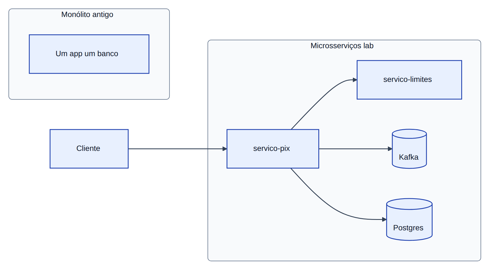
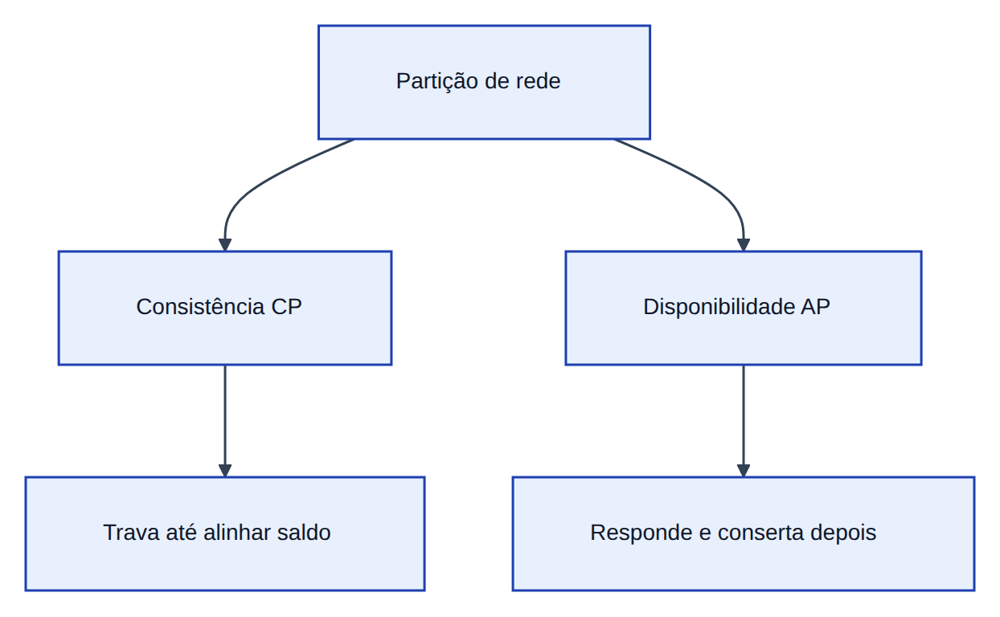

# Módulo 0 — Fundamentos de sistemas distribuídos

Este capítulo de teoria antecede o **Laboratório 00** do Módulo 0 ([banco mínimo no *kind*](../labs/lab-00-kind-banco-minimo.md)). Leia-o antes de subir o cluster.

## O banco que virou muitas salas

Um banco que era um prédio só — um programa, um banco de dados — modernizou e virou várias salas: *servico-pix*, *servico-limites*, antifraude, notificação. O cliente ainda vê “fiz um *Pix*”; para a plataforma são portas, filas e, muitas vezes, um correio interno (Kafka).

Cada porta é uma **fronteira de falha** — se a sala de limites trava, as outras podem continuar ou não, conforme o desenho. É também **fronteira de consistência**: cada sala tem sua agenda; não há mais um único caderno de contabilidade.

## Consistência

Dois caixas leem o mesmo saldo e aprovam débitos que, somados, estouram a conta. **Consistência** é todos enxergarem uma história que fecha. Num PostgreSQL, uma **transação ACID** resolve isso num lugar. Entre serviços, entram trancas, versão na linha ou **consistência eventual** — as cópias alinham depois de eventos e retries.

No lab: Postgres no *Pix* (transferência + outbox); *Limites* mock em memória, de propósito.

## Idempotência

O cliente confirma duas vezes porque a tela travou. **Idempotência** é: mesma chave → mesmo efeito que uma vez; a segunda tentativa devolve o mesmo recibo. No HTTP, `Idempotency-Key`; no Kafka, a mensagem pode repetir e o consumer não pode repetir efeito.

Fila “confiável” quase sempre significa **mensagem duplicada possível**. Sem idempotência, isso vira cobrança em dobro.

No lab: header no curl; Redis + Postgres no `servico-pix`; relay publica `pix.iniciado`.

## CAP — quando a rede corta

Três agências compartilham um livro-caixa e **cai a linha** entre elas (**partição**, o P de **CAP**). Ou todo mundo segue atendendo e os números podem divergir até a linha voltar (**disponibilidade**, A), ou alguém trava o balcão até alinhar o livro (**consistência**, C). Com partição ativa, não dá C+A+P ao mesmo tempo.

| | Significado | No lab |
|---|-------------|--------|
| **C** | Mesmo número agora | Saldo/limites críticos em Postgres |
| **A** | Responde degradado | *Pix* com erro claro se *Limites* cair |
| **P** | Comunicação entre nós falha | *Toxiproxy*, rede K8s, broker fora |

Em partition: **CP** (trava para não mentir) ou **AP** (responde e conserta depois). Dinheiro puxa CP; notificação costuma tolerar AP.

## PACELC — quando a rede está boa

CAP descreve o pior dia. Nos dias normais a pergunta é outra: resposta **rápida** ou **alinhada ao primário**? **PACELC** (Daniel Abadi) resume: se há partição, escolha C ou A; **senão**, escolha **latência (L)** ou **consistência (C)**.

Pense no restaurante: cardápio na parede (réplica/cache, pode estar um instante atrás) ou garçom que só responde depois de falar com a cozinha (mais lento, mais alinhado). No lab, o *Pix* responde rápido e o `pix.iniciado` segue pelo relay — API rápida, fila alinhada em seguida.

## Relógios e ordem

Relógios de servidores diferem alguns milissegundos (**clock skew**). Não use “hora do servidor” como ordem global. Prefira **versão na linha** no banco, ID de evento ou mesma chave sempre na mesma **partição** Kafka (fila ordenada por conta).

Na teoria existem **vector clocks** e o teorema **FLP** (consenso perfeito é impossível em certas condições). Na prática: **timeout**, eleição de **líder** (algoritmo **Raft**, usado no **etcd** do Kubernetes) e **quórum** (maioria dos nós concorda antes de gravar).

## Monólito e microsserviços

Monólito: um restaurante. Microsserviços: food hall — escala equipes, mas o pedido inteiro se perde se os balcões não conversarem. Fronteira só vale se o benefício (deploy, escala) paga o custo. Cadeia longa de HTTP vira **monólito distribuído**.

Este curso usa três serviços para ensinar plataforma, não para defender micro como religião.

## SLO e error budget

Como “entrega em 40 min” no delivery: **SLI** é o que você mede; **SLO**, a meta interna; **SLA**, o contrato com o cliente. **Error budget** é quanto pode quebrar antes de parar feature e focar em estabilidade. O Módulo 2 liga isso a métricas e traces.

## Anti-patterns

| Erro comum | Por que dói |
|------------|-------------|
| Dez HTTPs por clique | Falha e latência em cascata |
| Fila sem idempotência | Duplicidade financeira |
| “Eventual” sem desenho | Nunca converge |
| Sigla sem problema real | Decoração em reunião |

## Exercícios

1. Desenhe *Pix* → *Limites*: onde há um caderno só?
2. Se *Limites* cair: fila parada (CP) ou “tente de novo” (AP)?
3. Explique PACELC com o exemplo do restaurante.

## Troubleshooting

| Sintoma | Onde olhar |
|---------|------------|
| Saldo estranho | Idempotência, outbox, consumer |
| Lentidão pós-incidente | Retry storm (Módulo 1) |
| Só um pod falha | Estado local, cache |

## Próximo passo

[Lab 00](../labs/lab-00-kind-banco-minimo.md), depois [Módulo 1](modulo-01-resiliencia.md).

## Leitura complementar

- Kleppmann, *DDIA* — caps. 5–9
- Newman, *Building Microservices* — caps. 1–3
- [`REFERENCIAS.md`](../REFERENCIAS.md)
