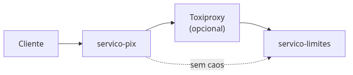
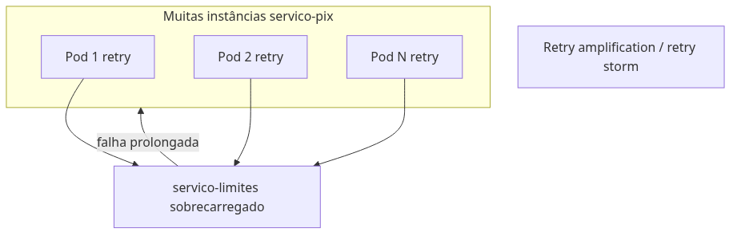
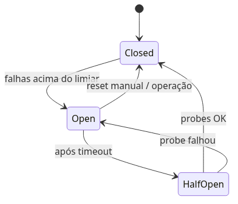

# Módulo 1 — Resiliência no código e caos na rede

**Laboratório:** [lab-01 — Toxiproxy e resiliência](../labs/lab-01-toxiproxy-resiliencia.md)

## Por que começamos pela resiliência

O *Pix* depende de *Limites*. Quando *Limites* engasga, o cliente vê loading infinito — ou o time sobe mais réplicas do *Pix* que **insistem** na porta travada, como dezenas de pessoas empurrando a mesma porta que já emperrou.

**Resiliência** é o conjunto de regras para o sistema continuar útil quando algo ao redor falha: saber **quanto tempo esperar** (**timeout**), **se vale tentar de novo** (**retry**), **quando parar de bater na porta** (**circuit breaker**, o “disjuntor” do quadro de luz) e **não gastar toda a energia num único vizinho** (**bulkhead** — compartimento estanque, como anteparas de navio).

**Jitter** é espera com uns milissegundos aleatórios a mais, para que dez instâncias do *Pix* não retentem todas no mesmo segundo (**efeito manada**). Sem isso, quando *Limites* volta, o pico de retries **impede** a recuperação — a **retry storm** (tempestade de tentativas).

*Limites* fora não pode derrubar o canal inteiro; retries sem limite nem critério pioram o incidente.

Este capítulo usa o *servico-pix* e o *servico-limites*. O *Pix* precisa responder rápido; o *Limites* pode oscilar por coleta de lixo da JVM (**GC**), deploy ou pico. Você simula falhas com um **proxy de caos** (*Toxiproxy*) — um “interruptor de latência” na rede — e implementa **Tenacity** (retry) e **pybreaker** (breaker) no Python.

## Cenário no laboratório

Antes de aprovar uma transferência, o *servico-pix* consulta o *servico-limites* (no lab, **R$ 5.000,00** mockados por conta). O fluxo é **síncrono**: o *Pix* só responde ao cliente depois que *Limites* responde — como pagar só depois que o caixa confirmar o saldo. Se *Limites* demora três segundos, o *Pix* não pode segurar um **pool de workers** (filas internas de requisições) indefinidamente; se *Limites* está morto, uma falha local não pode virar **falha em cascata** (tudo travado porque tudo espera tudo).

Na **Onda 1** da espinha dorsal, um *Toxiproxy* entra entre os dois serviços. Você controla latência, timeout e perda de pacotes como um engenheiro de plataforma, enquanto o time de aplicação ajusta Tenacity e circuit breaker no *Pix*.

## Timeout: o primeiro acordo com a realidade

**Timeout** é o tempo máximo que o *Pix* aceita esperar por *Limites* — como desligar após três minutos na música de espera do suporte: o problema pode continuar, mas você não fica preso na linha. Sem ele, threads ou corrotinas ficam presas, conexões TCP acumulam e um incidente em um dependente vira indisponibilidade total. Em FastAPI com **httpx**, isso se traduz em algo explícito: `httpx.Client(timeout=2.0)` ou, de forma mais fina, `timeout=httpx.Timeout(connect=0.5, read=2.0)` para distinguir falha de conexão de leitura lenta.

Timeout não é “otimização”; é **contrato operacional**. Alinha-se ao **SLO** (meta interna de qualidade, ex.: “99 % dos *Pix* em menos de 2 s”): se o app promete dois segundos ao cliente, o timeout interno a *Limites* precisa ser menor, reservando tempo para lógica local e **serialização** (transformar dados em JSON na rede).

## Retry: nova tentativa com critério

**Retry** significa repetir uma chamada após falha **transitória** — timeout, `503 Service Unavailable`, conexão recusada. Nem toda operação deve ser retentada: um `POST` que já debitou saldo e falhou na resposta pode exigir idempotência (Módulo 4), não um segundo débito cego.

| Abordagem | Efeito típico |
|-----------|----------------|
| Retry imediato em loop | **Efeito manada**: muitas instâncias retentam juntas e impedem *Limites* de se recuperar |
| **Backoff exponencial** | Espera dobra a cada falha (100 ms, 200 ms, 400 ms…) — dá “ar” ao serviço doente |
| **Jitter** | Segundos aleatórios na espera para não bater todos no mesmo instante |

A fórmula mental é: `espera ≈ base × 2^tentativa + jitter`. **Tenacity** implementa isso em Python.

### Efeito manada e retry storm

Quando *Limites* reinicia e centenas de *Pix* retentam no mesmo segundo, o tráfego extra **atrasa** a cura — **retry storm**. **Retry budget** é um teto (“no máximo 50 retries por minuto neste serviço”). **Coordinated omission** é armadilha de métrica: medir só a última tentativa esconde minutos de espera; meça do clique do cliente até a resposta.

### Orçamento de timeout em cadeia

Imagine três relógios em fila: **gateway** (porta do banco para o app) → **Pix** → **Limites**. O relógio de fora precisa ser o maior; o de dentro, o menor. Se o *Pix* espera 5 s em *Limites* mas o gateway mata tudo em 3 s, o cliente vê **504 Gateway Timeout** sem saber onde travou. Propague **deadline** (prazo que vai no cabeçalho HTTP e no trace OpenTelemetry) para cancelar trabalho inútil.

### Load shedding (descarte controlado)

Como a casa lotada que para de aceitar fila na porta: devolve **503 Service Unavailable** e `Retry-After` (“tente em 30 s”) em vez de aceitar todo mundo e travar por dentro.

## Circuit breaker: o disjuntor arquitetural

O **circuit breaker** monitora falhas a um dependente — como o disjuntor da casa que salta no curto. O *Pix* **para de insistir** em *Limites* doente e responde rápido com erro claro ou fallback acordado. Quando o erro passa de um limiar, o circuito **abre**: novas chamadas falham rápido (*fail-fast*) ou seguem um fallback acordado (ex.: negar *Pix* com mensagem clara, ou usar limite conservador em cache, se a política de negócio permitir).

| Estado | Comportamento |
|--------|----------------|
| **Closed** | Tráfego normal; falhas são contadas |
| **Open** | Chamadas não chegam ao dependente doente; resposta imediata |
| **Half-open** | “Teste com cuidado”: algumas chamadas passam; se der certo, volta ao normal; se falhar, abre de novo |

Configure **limiar de erro** (ex.: 50 % de falhas em 10 s), **slow-call detection** (chamada lenta demais conta como falha, como fila que não anda) e **fallback** (plano B: negar *Pix* com mensagem clara). Com circuito **aberto**, não combine **retry** em massa — só prolonga o incidente.

Em ambiente financeiro, registre mudanças de estado em **log JSON** (`circuit_breaker_state`, dependência, motivo). Alertas quando o circuito permanece aberto evitam que o time descubra o problema só pela fila de reclamações. **pybreaker** é uma biblioteca comum no ecossistema Python.

### Fail-fast

**Fail-fast** é falhar logo quando já sabe que não vai dar tempo — libera **threads** (trabalhadores internos) e conexões TCP em vez de segurar o spinner até o último segundo.

### Bulkhead

**Bulkhead** separa recursos por dependência: um “tanque” de conexões só para *Limites*, outro para Kafka, outro para rotas locais. Se *Limites* enche o tanque dele, o restante do *Pix* ainda atende health check e outras rotas.

## Caos de rede com Toxiproxy

**Toxiproxy** é um proxy que injeta falhas configuráveis — latência, limite de banda, timeout, reset — **sem mudar** o código de *Limites*. No Kubernetes, o *Pix* aponta `LIMITES_URL` para o Service do proxy; o proxy encaminha para o serviço real. Você aprende a reproduzir incidentes de forma repetível e a medir o comportamento do *Pix* antes e depois das correções.

*Toxics* úteis no laboratório: `latency` (atraso com jitter), `timeout`, `limit_data`, `slow_close`. A API HTTP na porta 8474 cria proxies e liga upstreams; o laboratório deste livro guia os comandos `curl` equivalentes.

## O que você implementa neste módulo

1. Cliente **httpx** com timeout explícito e mensagens de erro compreensíveis ao chamador.
2. **Tenacity** com backoff exponencial e jitter em operações seguras para retry.
3. **pybreaker** em torno da chamada a *Limites*, com logs estruturados nas transições de estado.
4. Experimento comparativo: retry sem jitter versus com jitter; compare **p95/p99** (latência que 95 % ou 99 % dos clientes experimentam — não só a média) com `hey` ou Locust.

## Trade-offs

| Padrão | Benefício | Custo / risco |
|--------|-----------|----------------|
| Retry com jitter | Recuperação de falhas transitórias | Retry storm se mal calibrado |
| Circuit breaker | Protege dependente e recursos locais | Falsos positivos abrem circuito |
| Bulkhead | Isola falha por pool | Mais complexidade de configuração |
| Fail-fast | Libera threads | Mais erros visíveis ao cliente |

## Anti-patterns

- Retry em `POST` sem idempotência (Módulo 4).
- Timeout único gigante em toda a cadeia.
- Breaker sem observabilidade de estado.
- Ignorar **cascading failure** entre serviços síncronos.

## Quando NÃO usar

- **Retry:** erro de negócio (`400`, saldo insuficiente).
- **Circuit breaker:** dependência que deve falhar de forma síncrona e auditável sempre.
- **Chaos (*Toxiproxy*):** em produção sem controle — apenas em ambientes dedicados.

## Produção real

- Custo cognitivo de políticas por serviço; padronize biblioteca (Tenacity + pybreaker) e dashboards de retry/breaker.
- Combine com **rate limiting** no edge quando breaker abrir com frequência.

## Troubleshooting

| Sintoma | Ação |
|---------|------|
| Recuperação lenta após incidente | Gráfico de retry rate; verificar jitter |
| 503 em massa | Estado do breaker; saúde de *Limites* |
| Latência p99 alta com erro baixo | Slow-call; coordinated omission |

## Exercícios

Ver [`labs/EXERCICIOS-FALHA-E-TROUBLESHOOTING.md`](../labs/EXERCICIOS-FALHA-E-TROUBLESHOOTING.md) — retry storm e thundering herd.

## Em resumo

Resiliência não é “retry até funcionar”. É definir **quanto esperar**, **quantas vezes tentar**, **quando parar de tentar** e **como provar** que o *Pix* sobrevive quando *Limites* oscila. O laboratório seguinte coloca isso em prática no *kind* com *Toxiproxy*.

## Leitura complementar

- [Tenacity](https://tenacity.readthedocs.io/)
- [*Toxiproxy*](https://github.com/Shopify/toxiproxy)
- Michael Nygard, *Release It!* — padrões de estabilidade em produção
