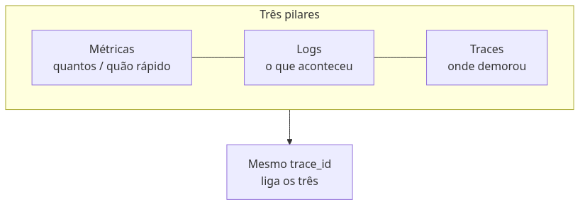
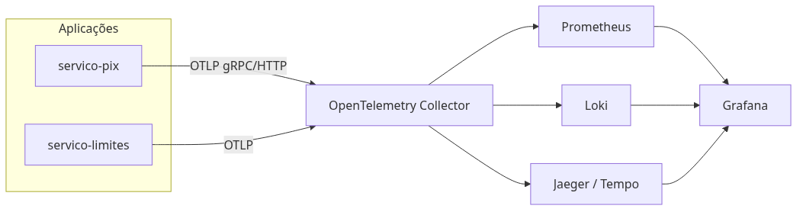
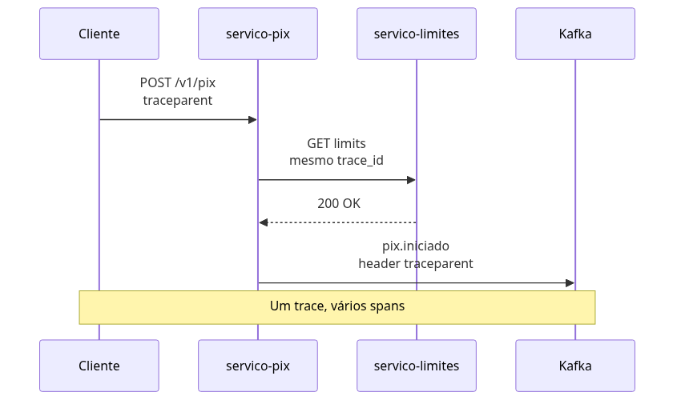
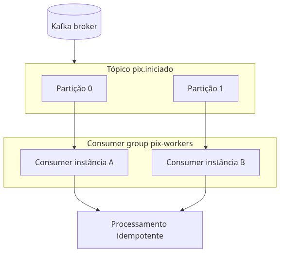

# Módulo 2 — Observabilidade avançada e diagnóstico

**Laboratórios:** [02 — OpenTelemetry + Jaeger](../labs/lab-02-opentelemetry-jaeger.md) · [02b — Kafka](../labs/lab-02b-kafka-consumer.md)

## O mistério do *Pix* que “sumiu”

O cliente vê o débito na tela; o destinatário diz que não recebeu. O fluxo passou por *Pix*, *Limites*, talvez **Kafka** (fila de mensagens — como correio interno entre sistemas) e um **worker** (programa que processa a fila em segundo plano). Sem evidência ligada, cada time defende sua camada.

**Observabilidade** é poder reconstruir o que aconteceu:

- **Métricas** — números agregados: quantos *Pix* por minuto, quantos erros, quão lento (como o painel “pacientes na urgência”).
- **Logs** — diário de uma requisição específica (“conta X, valor Y, negou por limite”).
- **Traces** — linha do tempo da jornada: *Pix* → *Limites* → publicação na fila (como rastrear encomenda pelos Correios).

**OpenTelemetry (OTel)** é o formato padrão para enviar os três. **Consumer lag** é “quantas cartas ainda na caixa postal” — fila acumulada esperando processamento.

Este capítulo instrumenta o lab e segue o **`trace_id`** (identificador único da jornada inteira) entre HTTP e mensagens.

## Os três pilares e como se complementam

Como na urgência do hospital: painel com volume (métrica), prontuário de um paciente (log), percurso triagem → exame → alta (trace).

| Pilar | Pergunta | No lab |
|-------|----------|--------|
| **Métricas** | Quantos? Quão rápido? Com que taxa de erro? | p95 do *Pix*, erros **5xx** (falha no servidor), **lag** do **consumer group** |
| **Logs** | O que aconteceu nesta requisição específica? | JSON com `trace_id`, `event`, `account_id` |
| **Traces** | Onde o tempo foi gasto entre serviços? | Árvore de spans no Jaeger |

Nenhum pilar substitui os outros. Métricas mostram tendência (“erros dobraram às 14h”). Logs mostram detalhe pontual. **Traces** mostram **causalidade** (quem chamou quem) e onde o tempo foi gasto — cada etapa é um **span** (trecho do trace). Trace não substitui mapa de dependências entre todos os serviços da empresa (**service graph**), só a jornada que você instrumentou.

O poder aparece quando os três compartilham o mesmo `trace_id`. **Exemplars** (em Grafana/Prometheus) são “cliques” de uma métrica que abrem o trace correspondente.

### SLI, SLO e SLA

Como delivery: “entrega em até 40 min”.

| Sigla | O que é | Exemplo *Pix* |
|-------|---------|---------------|
| **SLI** | Indicador medido | % de *Pix* respondidos em menos de 2 s |
| **SLO** | Meta interna do time | 99,9 % dos *Pix* abaixo de 2 s no mês |
| **SLA** | Promessa contratual ao cliente | Crédito ou multa se violar |

**Error budget** (Módulo 0) é quanto você ainda pode “errar” o SLO antes de congelar novidades e só corrigir estabilidade.



## OpenTelemetry: um padrão, vários backends

**OpenTelemetry (OTel)** unifica instrumentação. O *Pix* envia telemetria em formato padrão; o **Collector** encaminha para Jaeger, Prometheus, Loki. Em produção:

**Aplicação → OTel Collector → backends** (Jaeger/Tempo, Prometheus, Loki), não export direto do pod para cada ferramenta.



No Python, pacotes de instrumentação criam spans automaticamente; no publish Kafka manual, nomeie o span (`kafka.publish`, `outbox.publish`). O Collector aplica **sampling** (gravar só uma fração dos traces para não explodir custo — no lab, 100 % ajuda a aprender), remove **PII** (dados pessoais, Módulo 7) e corta **cardinalidade** (não use `user_id` como label de métrica se há milhões de usuários — vira milhões de séries).

### Prometheus, Loki e Grafana

| Ferramenta | O que faz |
|------------|-----------|
| **Prometheus** | Guarda métricas numéricas no tempo; dispara alertas |
| **Loki** | Guarda logs; busca por labels (`service=pix`), não por texto solto em tudo |
| **Grafana** | Painéis que juntam métrica, log e trace |

**RED** (Rate, Errors, Duration) resume saúde de API. **USE** (Utilization, Saturation, Errors) resume CPU, disco, rede.

No lab, Jaeger basta para aprender traces; documente como evoluir para a stack completa em `deploy/observability/`.

## Traces, spans e propagação de contexto

Um **trace** é a história inteira de um *Pix* — do clique até o evento na fila. Cada trecho com início e fim é um **span**: `pix.initiate`, `limites.check`, `kafka.publish`. **Propagação de contexto** é passar o `trace_id` adiante (HTTP e Kafka), como carimbar a mesma etiqueta em cada caixa da encomenda.

### W3C Trace Context

Padrão mundial no cabeçalho HTTP `traceparent`:

```http
traceparent: 00-<trace-id>-<parent-span-id>-<flags>
```

O **trace-id** (32 caracteres hex) identifica a transação inteira. O **parent-span-id** liga o span atual ao anterior. As **flags** indicam, entre outras coisas, se o trace foi amostrado. Serviços que ignoram esse cabeçalho quebram a cadeia — e você volta a ter “buracos” no Jaeger.



No **Kafka**, replique `traceparent` nos headers da mensagem (ou num envelope JSON) para que o worker continue o mesmo trace. Sem isso, o lab “*Pix* perdido” vira dois mundos desconectados.

## Logs estruturados: máquinas e humanos

Logs em texto livre (“Pix ok conta 123”) resistem mal a busca e correlação. **Log estruturado** em JSON permite indexar por `trace_id`, `account_id`, `event`:

```json
{
  "level": "INFO",
  "trace_id": "4bf92f3577b34da6a3ce929d0e0e4736",
  "service": "servico-pix",
  "event": "pix_initiated",
  "metadata": { "account_id": "acc_demo", "amount": 10.5 }
}
```

Ferramentas como *structlog* ou *python-json-logger* ajudam a manter campos consistentes. Em incidentes, a pergunta “mostre tudo deste trace” deve ter resposta em segundos.

## Amostragem

Em alto volume, gravar 100 % dos traces custa caro. **Head-based sampling** decide no começo da jornada se aquela história será guardada. **Tail-based sampling** (no Collector) guarda sobretudo traces que terminaram com erro — mais útil em produção. No lab, use 100 % até entender o fluxo.

### Depuração com tráfego real do cluster

Ferramentas como **mirrord** e **Telepresence** encaminham tráfego do cluster para um processo local, preservando DNS, secrets e políticas de rede. São úteis quando o bug só aparece com carga e configuração reais — além do escopo mínimo do lab, mas frequentes na carreira de plataforma.

## Apache Kafka na observabilidade e na operação

Kafka é uma **fila distribuída**: o *Pix* coloca uma “carta” no tópico `pix.iniciado`; outros programas leem quando podem. Isso **desacopla** — o cliente recebe resposta antes do antifraude terminar.



**Tópico** é o nome da fila; **partição** é uma subfila. Ordem é garantida **dentro** da partição (ex.: mesma `account_id` sempre na mesma partição), não no tópico inteiro.

**Consumer group** é um grupo de leitores que se dividem o trabalho — como vários carteiros, cada um com um bairro. **Rebalance** acontece quando entra ou sai leitor (deploy): as partições são redistribuídas; pode causar pausa e pico de lag.

**Acks** (confirmações do produtor): o broker só confirma gravação quando réplicas suficientes copiaram. **ISR** (*In-Sync Replicas*) são réplicas em dia; se cair demais, gravação pode parar.

**At-least-once** = a carta pode ser lida duas vezes (reenvio). **Exactly-once** ponta a ponta é raro; na prática combina-se transação + **idempotência** no consumer. **Poison pill** é mensagem que sempre quebra o processamento — mande para **DLQ** (*dead letter queue*, caixa de “não deu para processar”) após N tentativas.

**Lag** = cartas na caixa não lidas. **Backpressure** = produtor desacelera quando consumer não dá conta.

**Schema Registry** guarda o “formato do envelope” (Avro/Protobuf); mudar campo sem avisar quebra quem lê — **Pact** no Módulo 7 ajuda.

Para efeitos colaterais (notificação, antifraude), prefira **eventos**; para “o cliente espera resposta agora” (*Limites* no *Pix*), mantenha HTTP síncrono.

## Trade-offs

| Escolha | Prós | Contras |
|---------|------|---------|
| 100% tracing | Depuração rica | Custo de storage, cardinalidade |
| Head sampling | Simples | Perde traces raros |
| Tail sampling | Captura erros | Exige Collector avançado |
| Logs verbosos | Detalhe | PII, custo |

## Anti-patterns

- Dashboard sem SLO.
- Labels de alta cardinalidade (`user_id` em métrica).
- Trace sem propagar contexto no Kafka.
- Concluir saúde só por “API 200” com lag alto.

## Quando NÃO usar

- **Kafka:** baixo volume, equipe sem SRE de fila, necessidade de resposta síncrona única.
- **Tracing 100%:** tráfego massivo sem budget.
- **Jaeger sozinho:** sem métricas de saturação (falsos negativos em troubleshooting).

## Produção real

- **Sampling strategy** e política de retenção.
- **Noisy telemetry:** alertas em sintomas (SLO), não em todo log INFO.
- Custo de cardinalidade e storage — FinOps básico.

## Troubleshooting

Cenário: “trace mostra timeout, métricas parecem normais” — abra spans filhos, correlacione logs por `trace_id`, verifique pool de threads e lag Kafka. Lista completa: [`labs/EXERCICIOS-FALHA-E-TROUBLESHOOTING.md`](../labs/EXERCICIOS-FALHA-E-TROUBLESHOOTING.md).

## Exercícios

1. Quebre propagação de `traceparent` e observe buraco no Jaeger.
2. Force lag alto e correlacione com span `kafka.publish`.
3. Liste três labels que não devem virar métrica Prometheus.

## Em resumo

Observabilidade transforma hipótese vaga em evidência: o span `kafka.publish` com timeout e o log com o mesmo `trace_id` apontam o broker, não “a fila em geral”. O laboratório instrumenta o código; o 02b liga fila, lag e traces.

## Leitura complementar

- [OpenTelemetry Python](https://opentelemetry-python.readthedocs.io/)
- [W3C Trace Context](https://www.w3.org/TR/trace-context/)
- [Apache Kafka — documentação](https://kafka.apache.org/documentation/)
