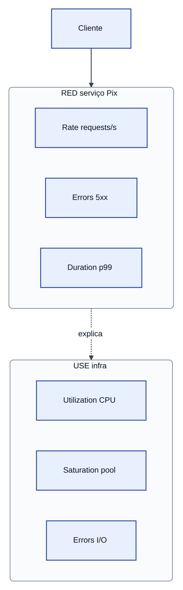
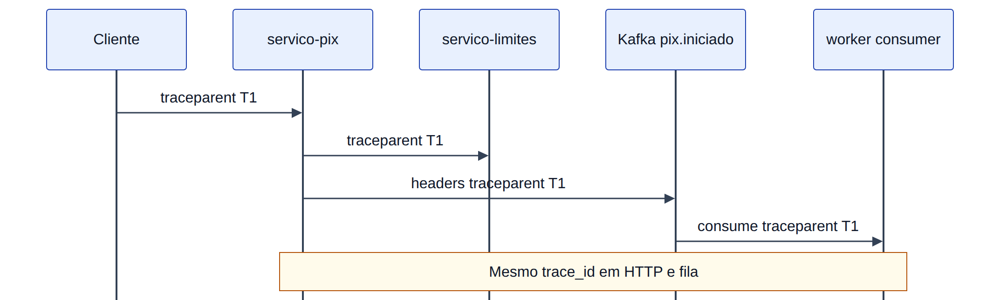
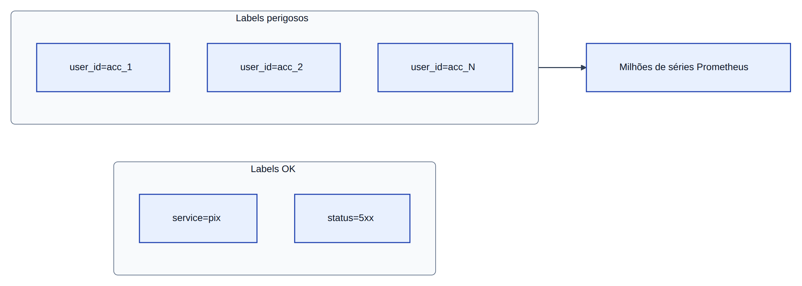
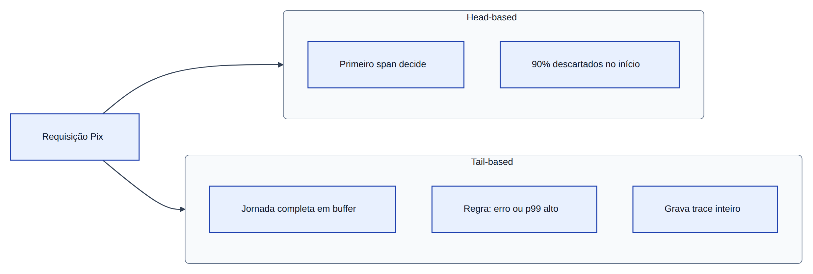
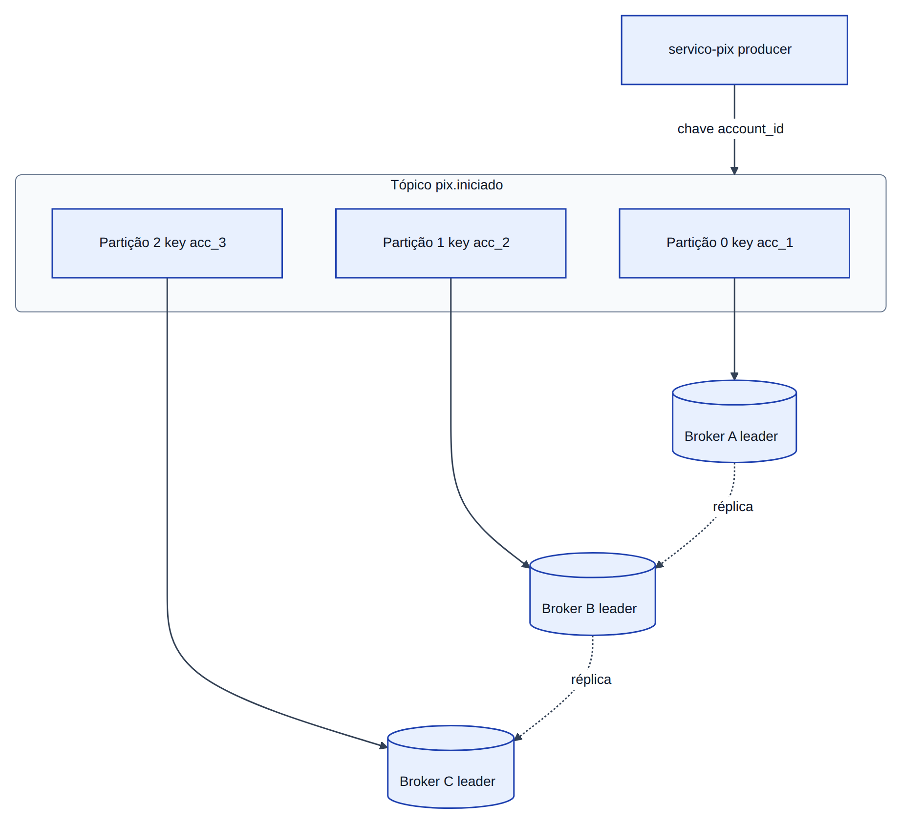
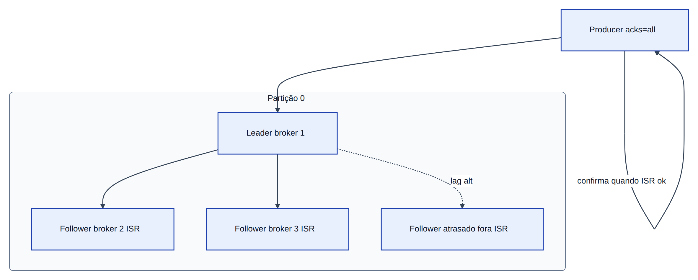
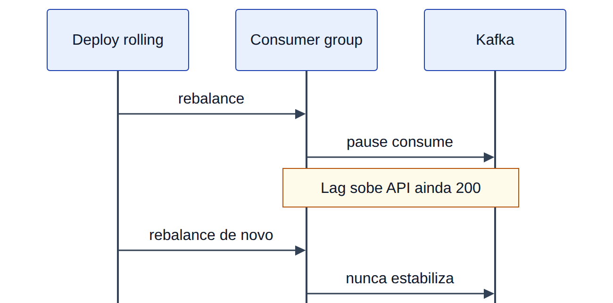

# Módulo 2 — Observabilidade avançada e diagnóstico

**Laboratórios:** [02 — OpenTelemetry + Jaeger](../labs/lab-02-opentelemetry-jaeger.md) · [02b — Kafka](../labs/lab-02b-kafka-consumer.md)

## O mistério do *Pix* que “sumiu”

O cliente vê o débito na tela; o destinatário diz que não recebeu. O fluxo passou por *Pix*, *Limites*, talvez **Kafka** (fila de mensagens — como correio interno entre sistemas) e um **worker** (programa que processa a fila em segundo plano). Sem evidência ligada, cada time defende sua camada.

**Observabilidade** é poder reconstruir o que aconteceu:

- **Métricas** — números agregados: quantos *Pix* por minuto, quantos erros, quão lento (como o painel “pacientes na urgência”).
- **Logs** — diário de uma requisição específica (“conta X, valor Y, negou por limite”).
- **Traces** — linha do tempo da jornada: *Pix* → *Limites* → publicação na fila (como rastrear encomenda pelos Correios).

**OpenTelemetry (OTel)** é o formato padrão para enviar os três. **Consumer lag** é “quantas cartas ainda na caixa postal” — fila acumulada esperando processamento.

Este capítulo instrumenta o lab e segue o **`trace_id`** (identificador da requisição de ponta a ponta) entre HTTP e mensagens.

> **Figuras deste capítulo:** três pilares · pipeline OTel · trace *Pix* · propagação Kafka · RED/USE · cardinalidade · sampling · partições/ISR · consumer group · rebalance · DLQ.

## Os três pilares e como se complementam


Como na urgência do hospital: painel com volume (métrica), prontuário de um paciente (log), percurso triagem → exame → alta (trace).

| Pilar | Pergunta | No lab |
|-------|----------|--------|
| **Métricas** | Quantos? Quão rápido? Com que taxa de erro? | p95 do *Pix*, erros **5xx** (falha no servidor), **lag** do **consumer group** |
| **Logs** | O que aconteceu nesta requisição específica? | JSON com `trace_id`, `event`, `account_id` |
| **Traces** | Onde o tempo foi gasto entre serviços? | Árvore de spans no Jaeger |

Nenhum pilar substitui os outros. Métricas mostram tendência (“erros dobraram às 14h”). Logs mostram detalhe pontual. **Traces** mostram **causalidade** (quem chamou quem) e onde o tempo foi gasto — cada etapa é um **span** (trecho do trace). Trace não substitui mapa de dependências entre todos os serviços da empresa (**service graph**), só a jornada que você instrumentou.

O poder aparece quando os três compartilham o mesmo `trace_id`.

### Exemplars: da métrica ao trace em um clique

**Exemplars** ligam um ponto de série temporal (ex.: p99 de latência às 14:03) a um **trace_id** concreto daquele instante. No Grafana, ao inspecionar um histograma Prometheus com exemplars habilitados, abre-se o trace correspondente no Jaeger ou Tempo sem procurar manualmente a requisição culpada.

Requisitos práticos:

- histogramas com `trace_id` (ou span context) anexado no momento da observação;
- backend que preserve exemplars (Prometheus 2.26+, Grafana 9+);
- **sampling** que ainda grave o trace referenciado — exemplar inútil se o trace foi descartado.

Em incidentes de *Pix*, a sequência usual é: SLO em risco → gráfico RED → exemplar no p99 → span `limites.check` com timeout.

### SLI, SLO e SLA

Como delivery: “entrega em até 40 min”.

| Sigla | O que é | Exemplo *Pix* |
|-------|---------|---------------|
| **SLI** | Indicador medido | % de *Pix* respondidos em menos de 2 s |
| **SLO** | Meta interna do time | 99,9 % dos *Pix* abaixo de 2 s no mês |
| **SLA** | Promessa contratual ao cliente | Crédito ou multa se violar |

**Error budget** (Módulo 0) é quanto você ainda pode “errar” o SLO antes de congelar novidades e só corrigir estabilidade.

## OpenTelemetry: um padrão, vários backends

**OpenTelemetry (OTel)** unifica instrumentação. O *Pix* envia telemetria em formato padrão; o **Collector** encaminha para Jaeger, Prometheus, Loki. Em produção:

**Aplicação → OTel Collector → backends** (Jaeger/Tempo, Prometheus, Loki), não export direto do pod para cada ferramenta.


No Python, pacotes de instrumentação criam spans automaticamente; no publish Kafka manual, nomeie o span (`kafka.publish`, `outbox.publish`). O Collector aplica **sampling** (gravar só uma fração dos traces para não explodir custo — no lab, 100 % ajuda a aprender), remove **PII** (dados pessoais, Módulo 7) e corta **cardinalidade** explosiva (ver seção abaixo).

### OpenTelemetry: onde fica no código

| Serviço | Arquivo | Responsabilidade |
|---------|---------|------------------|
| *Pix* | `apps/servico-pix/app/telemetry.py` | `setup_telemetry()` + `HTTPXClientInstrumentor` (trace até *Limites*) + FastAPI |
| *Pix* | `apps/servico-pix/app/main.py` | Chama setup/instrumentação; **não** duplique bootstrap OTel no handler |
| *Limites* | `apps/servico-limites/app/telemetry.py` | Export OTLP + FastAPI |
| Relay | `apps/worker-outbox-relay/app/telemetry.py` | Span `outbox.publish` |

Ative com `OTEL_EXPORTER_OTLP_ENDPOINT` e `OTEL_SERVICE_NAME`. Sem endpoint, o código não exporta (comportamento seguro para lab local). Detalhes: [lab 02](../labs/lab-02-opentelemetry-jaeger.md).

### Prometheus, Loki e Grafana

| Ferramenta | O que faz |
|------------|-----------|
| **Prometheus** | Guarda métricas numéricas no tempo; dispara alertas |
| **Loki** | Guarda logs; busca por labels (`service=pix`), não por texto solto em tudo |
| **Grafana** | Painéis que juntam métrica, log e trace |

### RED vs USE: dois vocabulários, dois mundos



| Framework | Onde aplicar | Métricas típicas | Pergunta |
|-----------|--------------|------------------|----------|
| **RED** | Serviços request/response (*Pix*, *Limites*) | Requests/s, taxa de erro, latência p50/p95/p99 | O cliente está sendo atendido? |
| **USE** | Recursos compartilhados (CPU, disco, rede, pool JDBC) | Utilização %, saturação (fila cheia?), erros de I/O | A infra aguenta a carga? |

**RED** responde sintomas de negócio; **USE** explica *por que* o RED piorou (CPU a 95 %, disco saturado, pool de conexões esgotado). Alertar só em CPU alta sem RED de *Pix* gera falso positivo; alertar só em “API 200” com pool saturado gera falso negativo.

No lab, Jaeger basta para aprender traces; documente como evoluir para a stack completa em `deploy/observability/`.

## Traces, spans e propagação de contexto

Um **trace** é a história inteira de um *Pix* — do clique até o evento na fila. Cada trecho com início e fim é um **span**: `pix.initiate`, `limites.check`, `kafka.publish`. **Propagação de contexto** é passar o `trace_id` adiante (HTTP e Kafka), como carimbar a mesma etiqueta em cada caixa da encomenda.

### W3C Trace Context

Padrão mundial no cabeçalho HTTP `traceparent`:

```http
traceparent: 00-<trace-id>-<parent-span-id>-<flags>
```

O **trace-id** (32 caracteres hex) identifica a transação inteira. O **parent-span-id** liga o span atual ao anterior. As **flags** indicam, entre outras coisas, se o trace foi amostrado. Serviços que ignoram esse cabeçalho quebram a cadeia — e você volta a ter “buracos” no Jaeger.


No **Kafka**, replique `traceparent` nos headers da mensagem (ou num envelope JSON) para que o worker continue o mesmo trace. Sem isso, o lab “*Pix* perdido” vira dois mundos desconectados.



## Logs estruturados: máquinas e humanos

Logs em texto livre (“Pix ok conta 123”) resistem mal a busca e correlação. **Log estruturado** em JSON permite indexar por `trace_id`, `account_id`, `event`:

```json
{
  "level": "INFO",
  "trace_id": "4bf92f3577b34da6a3ce929d0e0e4736",
  "service": "servico-pix",
  "event": "pix_initiated",
  "metadata": { "account_id": "acc_demo", "amount": 10.5 }
}
```

Ferramentas como *structlog* ou *python-json-logger* ajudam a manter campos consistentes. Em incidentes, a pergunta “mostre tudo deste trace” deve ter resposta em segundos.

## Cardinalidade explosiva e high-cardinality labels



Cada combinação única de **labels** em Prometheus vira uma **série temporal**. Labels de baixa cardinalidade (`service=pix`, `status=500`) são baratas. Labels de **alta cardinalidade** (`user_id`, `trace_id`, `idempotency_key`) explodem o número de séries:

| Label | Cardinalidade | Veredicto |
|-------|---------------|-----------|
| `service`, `method`, `status_class` | Baixa | Métricas RED |
| `account_id` em banco com milhões de contas | Altíssima | **Nunca** em métrica — use log/trace |
| `trace_id` | Uma por request | Só em trace backend, não em PromQL |

**Cardinalidade explosiva** estoura memória do Prometheus, aumenta custo de ingestão em vendors (Datadog, Honeycomb) e torna queries lentas. Regra: se o valor é único por requisição, não é label de métrica — é atributo de **span** ou campo de **log**.

O OTel Collector pode aplicar **attribute limits** e drop de labels antes do export. FinOps de observabilidade: monitore `prometheus_tsdb_symbol_table_size_bytes` e cardinality por métrica.

## Amostragem: head, tail e adaptativo

Em alto volume, gravar 100 % dos traces custa caro (storage, ingestão, indexação). Estratégias:

| Estratégia | Quando decide | Prós | Contras |
|------------|---------------|------|---------|
| **Head-based** | No primeiro span (SDK ou ingress) | Simples, previsível de custo | Perde traces raros que “pareciam normais” no início |
| **Tail-based** | Após a jornada terminar (Collector) | Guarda erros e latência extrema | Buffer temporário, Collector mais complexo |
| **Adaptive / probabilistic** | Taxa dinâmica (ex.: 1 % base, 100 % se erro) | Equilibra custo e utilidade | Tuning por serviço |

**Head-based sampling** marca `traceparent` com flag “não amostrado” — downstream respeita e não grava spans filhos.

**Tail-based sampling** (OpenTelemetry Collector `tail_sampling`) avalia regras no fim: `status_code = ERROR`, `latency > 2s`, `account_id` em allowlist de debug. Ideal para *Pix* em produção: volume alto, mas incidentes precisam de evidência completa.

**Sampling adaptativo** sobe a taxa quando SLO queima ou quando um serviço entra em canary — útil em deploy, mas exige governança para não dobrar a conta do vendor na madrugada do rollback.



No lab, use 100 % até entender o fluxo; documente no README do time a política de produção (ex.: 5 % head + tail rules para 5xx).

### Custo de tracing

Custo ≈ **volume de spans** × **tamanho médio do span** × **retenção** × **preço do backend**.

| Fator | Alavanca |
|-------|----------|
| Volume | Sampling, menos spans automáticos “barulhentos” |
| Tamanho | Não colocar payload JSON inteiro em atributos |
| Retenção | 7 dias hot, 30 dias cold, PII scrub antes |
| Vendor | OTLP para backend próprio vs SaaS por span ingerido |

Um *Pix* com 15 spans × 100k req/min × 100 % sampling explode orçamento. SRE maduro negocia **budget de telemetria** junto ao error budget de produto.

### Correlation ID vs trace ID

| Identificador | Escopo | Quem gera | Uso |
|---------------|--------|-----------|-----|
| **Correlation ID** (`X-Correlation-ID`, `X-Request-ID`) | Negócio / suporte / logs legados | API gateway ou primeiro hop | Ticket de atendimento, grep em log textual |
| **Trace ID** (W3C, 32 hex) | Observabilidade distribuída | OTel SDK ou ingress instrumentado | Jaeger, Tempo, árvore de spans |

Podem coexistir: o gateway gera `correlation_id` para o cliente; o SDK gera `trace_id` para APM. **Não** substituam um pelo outro — correlacione nos logs (`correlation_id` + `trace_id` no mesmo JSON). Suporte humano busca correlation; engenheiro de plantão busca trace.

### Depuração com tráfego real do cluster

Ferramentas como **mirrord** e **Telepresence** encaminham tráfego do cluster para um processo local, preservando DNS, secrets e políticas de rede. São úteis quando o bug só aparece com carga e configuração reais — além do escopo mínimo do lab, mas frequentes na carreira de plataforma.

## Apache Kafka: além da “fila moderna”

Kafka é um **log replicado e particionado** — não uma fila clássica que apaga ao consumir. O *Pix* appenda eventos em `pix.iniciado`; consumidores avançam **offsets** independentes. Isso permite replay, múltiplos leitores e desacoplamento temporal.




### Partições, chave e ordem

**Tópico** = assunto; **partição** = shard ordenado. Mensagens com a mesma **chave** (`account_id`) vão à mesma partição → ordem por conta. Sem chave, round-robin — ordem global não existe.

**Sticky partitioning** (produtor Kafka 2.4+): sem chave explícita, o produtor “gruda” numa partição por um lote de mensagens, reduzindo fragmentação e melhorando batching — útil para throughput, mas não substitui chave de negócio quando ordem por conta importa.

### ISR, acks e durabilidade

Cada partição tem um **leader** e **followers** no cluster.

| Conceito | Significado |
|----------|-------------|
| **ISR** (*In-Sync Replicas*) | Réplicas que copiaram até o offset do leader dentro do limite de tempo |
| **acks=0** | Produtor não espera confirmação — rápido, pode perder |
| **acks=1** | Leader gravou — follower pode estar atrasado |
| **acks=all** | Todos os ISR confirmaram — mais seguro para pagamento |
| **min.insync.replicas** | Mínimo de ISR para aceitar `acks=all`; se cair abaixo, produtor recebe erro |

Se um follower fica lento, sai do ISR; se o leader cai, um ISR elegível vira leader. **Unclean leader election** (permitir leader fora do ISR) recupera mais rápido mas **pode perder** mensagens já “confirmadas” ao produtor — em banco, costuma ficar desabilitado.



### Consumer group: internals e rebalance storm

**Consumer group** = conjunto de instâncias que cooperam. Cada partição é consumida por **no máximo um** consumer do grupo por vez.

Internamente:

1. Um consumer é **group coordinator** (broker) e outro pode ser **leader** do grupo (consumer).
2. O leader calcula a atribuição partição → consumer e publica o plano.
3. Cada consumer faz **poll**; após processar, **commit** de offset (auto ou manual).

**Rebalance** redistribui partições quando: scale up/down, deploy rolling, sessão expirada (`max.poll.interval.ms` estourado porque processamento demorou demais), novo consumer entra.



**Rebalance storm**: deploy frequente + processamento lento → grupo entra em loop de rebalance → **ninguém consome** → lag explode enquanto API parece saudável.

Mitigações:

| Mitigação | Efeito |
|-----------|--------|
| `static membership` (`group.instance.id`) | Reduz rebalance em restart de pod |
| Processamento < `max.poll.interval.ms` | Evita expulsão por “morto” |
| Menos partições que consumers ociosos | Evita rebalance desnecessário |
| **Cooperative sticky assignor** | Revoga só partições necessárias, não para o grupo inteiro |

### Semântica de entrega e exactly-once na prática

| Semântica | O que garante | Como aparece no *Pix* |
|-----------|---------------|------------------------|
| **At-most-once** | Pode perder | Commit offset antes de processar |
| **At-least-once** | Pode duplicar | Processar, depois commit — + idempotência |
| **Exactly-once** (Kafka ↔ Kafka) | Sem duplicata entre tópicos | Transação de produtor + `read_committed` |
| **Exactly-once** (Kafka ↔ Postgres) | Efeito único no negócio | **Outbox** + idempotência — não só checkbox do broker |

**Transactional producer** (`transactional.id`): envia mensagens em transação Kafka; commit atômico com offsets do consumer no mesmo `transactional.id` — EOS **dentro** do ecossistema Kafka. Para gravar saldo no Postgres, ainda precisa outbox ou dedup table (Módulo 4).

### Poison pill, retries e DLQ


**Poison pill**: mensagem malformada ou bug que **sempre** falha — consumer reprocessa infinitamente, partições travam, lag sobe.

Padrão **DLQ** (*dead letter queue*):

1. Retry com backoff e contador (`N` tentativas).
2. Publicar em `pix.iniciado.dlq` com headers: erro, stack resumido, offset original.
3. Alertar time; **não** commitar offset da mensagem original sem política clara (ou commit para não bloquear fila — documente a escolha).

Alternativa: **quarantine topic** + ferramenta de replay manual após correção.

### Tópicos compactados e schema evolution

**Log compacted** (`cleanup.policy=compact`): Kafka mantém a **última** mensagem por chave — ideal para “estado atual da conta” (`account_id` → saldo projetado), não para histórico imutável de *Pix* (use delete/retention por tempo).

**Schema Registry** (Confluent ou compatível): versiona Avro/Protobuf/JSON Schema.

| Modo de compatibilidade | Regra |
|-------------------------|-------|
| **BACKWARD** | Consumidor novo lê dados antigos (campo opcional novo) |
| **FORWARD** | Produtor antigo ainda válido |
| **FULL** | Ambos |

Mudar campo sem compatibilidade quebra consumers silenciosamente — combine Registry com **Pact** (Módulo 7) e testes de contrato.

**Lag** = mensagens não consumidas. **Backpressure** = produtor limita taxa quando lag > limiar.

Para efeitos colaterais (notificação, antifraude), prefira **eventos**; para “o cliente espera resposta agora” (*Limites* no *Pix*), mantenha HTTP síncrono.

## Trade-offs

| Escolha | Prós | Contras |
|---------|------|---------|
| 100% tracing | Depuração rica | Custo de storage, cardinalidade |
| Head sampling | Simples | Perde traces raros |
| Tail sampling | Captura erros | Exige Collector avançado |
| Logs verbosos | Detalhe | PII, custo |

## Anti-patterns

- Dashboard sem SLO.
- Labels de alta cardinalidade (`user_id` em métrica).
- Trace sem propagar contexto no Kafka.
- Concluir saúde só por “API 200” com lag alto.

## Quando NÃO usar

- **Kafka:** baixo volume, equipe sem SRE de fila, necessidade de resposta síncrona única.
- **Tracing 100%:** tráfego massivo sem budget.
- **Jaeger sozinho:** sem métricas de saturação (falsos negativos em troubleshooting).

## Produção real

- **Sampling strategy** e política de retenção.
- **Noisy telemetry:** alertas em sintomas (SLO), não em todo log INFO.
- Custo de cardinalidade e storage — FinOps básico.

## Troubleshooting

Cenário: “trace mostra timeout, métricas parecem normais” — abra spans filhos, correlacione logs por `trace_id`, verifique pool de threads e lag Kafka. Lista completa: [`labs/EXERCICIOS-FALHA-E-TROUBLESHOOTING.md`](../labs/EXERCICIOS-FALHA-E-TROUBLESHOOTING.md).

## Exercícios

1. Quebre propagação de `traceparent` e observe buraco no Jaeger.
2. Force lag alto e correlacione com span `kafka.publish`.
3. Liste três labels que não devem virar métrica Prometheus.

## Em resumo

Observabilidade transforma hipótese vaga em evidência: o span `kafka.publish` com timeout e o log com o mesmo `trace_id` apontam o broker, não “a fila em geral”. O laboratório instrumenta o código; o 02b liga fila, lag e traces.

## Leitura complementar

- [OpenTelemetry Python](https://opentelemetry-python.readthedocs.io/)
- [W3C Trace Context](https://www.w3.org/TR/trace-context/)
- [Apache Kafka — documentação](https://kafka.apache.org/documentation/)
