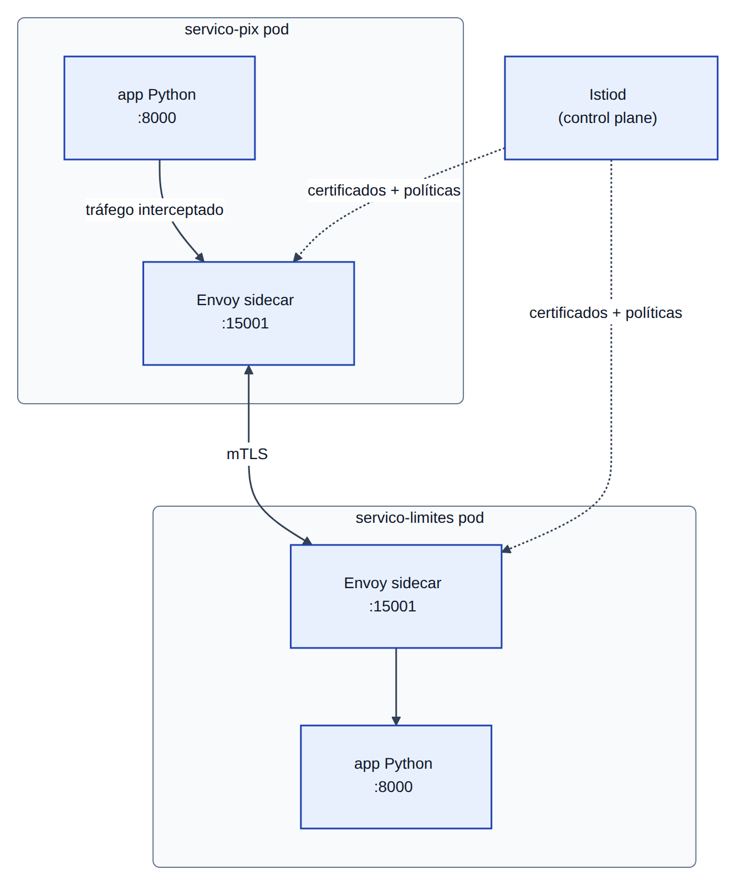
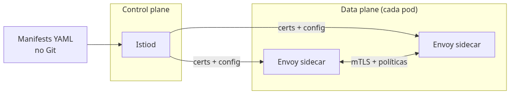
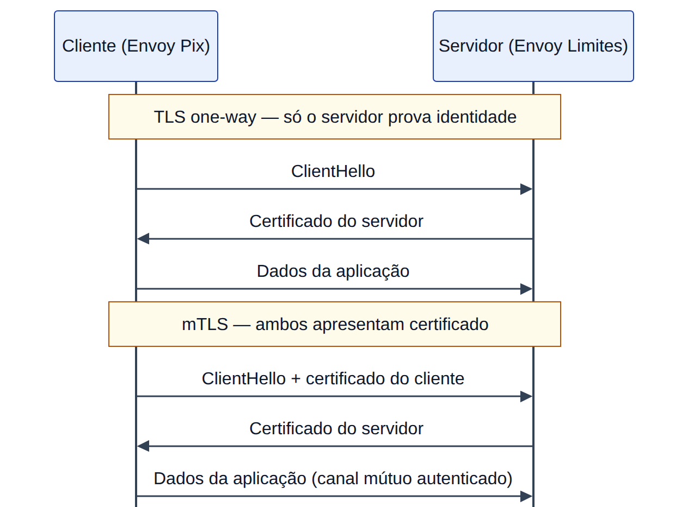
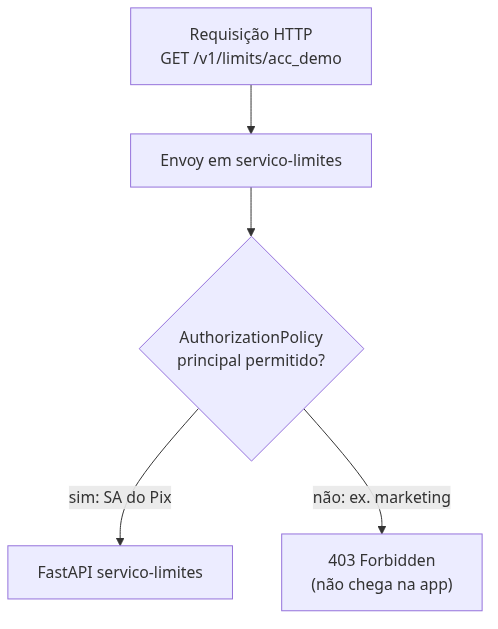
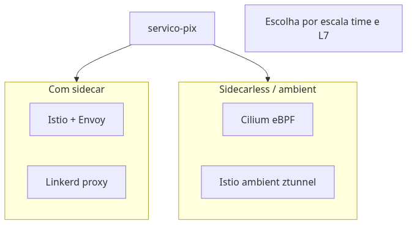
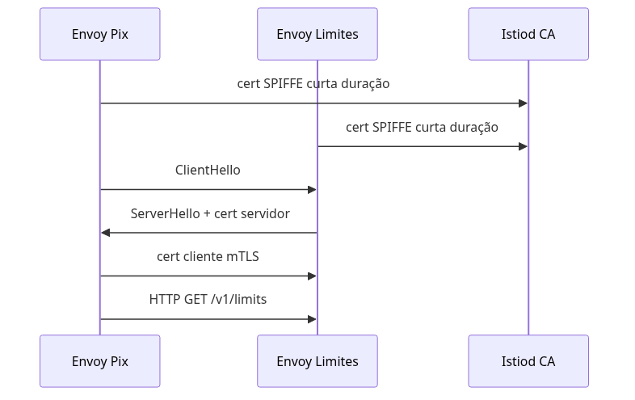

# Módulo 3 — Service mesh e segurança em trânsito

**Laboratório:** [03 — Istio mTLS](../labs/lab-03-istio-mtls.md)

## Segurança além da aplicação

**HTTPS** no site criptografa do celular até a portaria do banco (**ingresso**). Dentro do data center, microsserviços antigos falavam HTTP aberto — qualquer processo na rede podia escutar ou se passar por outro.

**mTLS** (*mutual TLS*) é crachá verificado **nos dois lados** em cada conversa: *Pix* prova quem é, *Limites* prova quem é, antes de trocar dados. Só isso não responde “esta conta pode pagar?” — isso é regra de negócio no código.

**Service mesh** (malha de serviços) coloca um **sidecar** — um proxy pequeno ao lado de cada **pod** (caixa onde o container roda) — que criptografa, mede e aplica regras. No lab usamos **Istio** com proxy **Envoy** e controlador **Istiod**. Assim o time Python não reimplementa TLS em cada release.

Este capítulo usa o namespace `core-banking` no Kubernetes.

> **Figuras:** fluxo mTLS · control/data plane · TLS vs mTLS · AuthorizationPolicy · panorama de meshes · handshake.

## Cenário no laboratório

Dados de limites e decisões de *Pix* trafegam entre *servico-pix* e *servico-limites*. Você exige:

1. Criptografia **entre** workloads (não só até o ingress).
2. Prova de identidade de quem chama (**ServiceAccount** do Kubernetes — RG do pod, não IP que muda a cada reinício).
3. Negação demonstrável para workloads não autorizados (HTTP 403 no proxy, antes do Python).

Um hipotético *servico-marketing* no mesmo cluster deve ser bloqueado ao tentar `GET /v1/limits/...` em *Limites*, enquanto o *Pix* continua funcionando.

## O que é um service mesh

A aplicação continua chamando `http://servico-limites:8000`. O sidecar intercepta: negocia **mTLS**, aplica **AuthorizationPolicy**, gera métricas. Certificados são de curta duração e renovados pelo mesh — como crachá que expira todo dia.



O diagrama mostra o caminho real: *Pix* → sidecar → **mTLS** → sidecar → *Limites*. O **Istiod** (control plane) distribui certificados e configuração aos sidecars.

## Control plane e data plane

| Camada | Papel |
|--------|--------|
| **Control plane** (Istiod) | “Cérebro”: políticas, certificados, configuração enviada aos proxies |
| **Data plane** (Envoy) | “Músculo”: cada sidecar que efetivamente criptografa e bloqueia tráfego |



Manifests versionados no Git descrevem o estado desejado; Istiod reconcilia o que cada sidecar deve fazer. Sem mesh, cada squad escolhe bibliotecas TLS diferentes — auditoria vira pesadelo.

## mTLS: identidade nos dois lados

### TLS convencional (one-way)

No HTTPS clássico, o **cliente** valida o certificado do **servidor**. O servidor não exige certificado forte do cliente. Basta para browser → API pública; insuficiente para provar qual microserviço chamou qual.

### mTLS (mutual TLS)

Em **mTLS**, cliente e servidor apresentam certificado. Ambos autenticam antes dos dados de aplicação fluírem. No Istio, certificados de workload são emitidos pela CA interna do mesh, com vida curta, amarrados ao **ServiceAccount** do pod.



### Modos PeerAuthentication

| Modo | Uso |
|------|-----|
| **DISABLE** | Sem mTLS automático do mesh |
| **PERMISSIVE** | Aceita plaintext e mTLS — migração gradual |
| **STRICT** | Apenas mTLS entre workloads do mesh |

No lab, **STRICT** no namespace `core-banking` força o comportamento de produção:

```yaml
apiVersion: security.istio.io/v1beta1
kind: PeerAuthentication
metadata:
  name: default
  namespace: core-banking
spec:
  mtls:
    mode: STRICT
```

Teste válido: chamada plaintext entre pods deve falhar na camada Envoy; tráfego mesh-autenticado segue.

### SPIFFE, principals e limites do mTLS

**SPIFFE** é padrão de identidade de workload em ambientes cloud. No Istio, o **principal** identifica quem chama, por exemplo:

```text
cluster.local/ns/core-banking/sa/servico-pix-service-account
```

Isso amarra política a identidade estável, não a IP.

**mTLS não substitui:**

- Autorização de **negócio** (“esta conta pode transferir?”)
- Vazamento de **secrets** no pod ou no Git
- Acesso indevido **após** comprometimento do workload (lateral movement dentro do pod)
- **Privilege escalation**, exfiltração de dados, abuso de credencial de banco
- Proteção de **logs e traces** com PII — Módulo 7

SPIRE/SPIFFE em escala multi-cluster; OAuth2/OIDC para usuários humanos e workloads que falam com APIs públicas — complementam o mesh, não competem.

## AuthorizationPolicy: quem pode chamar quem

**AuthorizationPolicy** é lista de permissão no proxy: avalia a chamada **antes** do Python rodar — como segurança na porta da sala que nem deixa entrar quem não tem crachá certo. Exemplo de lista branca: só o principal do *Pix* pode `GET /v1/limits/*` em *Limites*.

```yaml
apiVersion: security.istio.io/v1beta1
kind: AuthorizationPolicy
metadata:
  name: so-pix-chama-limites
  namespace: core-banking
spec:
  selector:
    matchLabels:
      app: servico-limites
  action: ALLOW
  rules:
    - from:
        - source:
            principals:
              - cluster.local/ns/core-banking/sa/servico-pix-service-account
      to:
        - operation:
            methods: ["GET"]
            paths: ["/v1/limits/*"]
```

Com `action: ALLOW` e regras explícitas, o padrão é negar o restante. Outro service account recebe **403** sem executar código Python — evidência auditável.



## Outros recursos do mesh (visão adiante)

| Recurso | Uso |
|---------|-----|
| **VirtualService** | Roteamento, canary, mirror (Módulo 5) |
| **DestinationRule** | Subsets v1/v2, políticas de conexão |
| **Gateway** | Porta de entrada da internet para o cluster (**north-south** = tráfego de fora para dentro) |
| **ServiceEntry** | Registrar API externa (fora do Kubernetes) no mesh |
| **DestinationRule** | Definir subsets (v1/v2) e políticas de conexão |

## Service mesh ≠ só Istio

O lab usa **Istio + Envoy** porque é referência de mercado e documentação abundante. O mercado evoluiu para várias malhas e modos **sem sidecar**.

| Solução | Data plane | Destaque | Trade-off |
|---------|------------|----------|-----------|
| **Istio** | Envoy sidecar | Políticas ricas, ecossistema CNCF | Complexidade, memória por pod |
| **Linkerd** | Linkerd2-proxy (Rust) | Operação mais simples, footprint menor | Menos features que Istio em L7 avançado |
| **Cilium Service Mesh** | **eBPF** no kernel + Envoy opcional | Observabilidade L3/L4/L7, sem sidecar em modo ambient | Requer kernel moderno, curva eBPF |
| **Consul Connect** | Envoy sidecar | Integração multi-datacenter HashiCorp | Licenciamento e ops próprios |

### Ambient mesh e sidecarless

**Ambient mesh** (Istio): separa **camada L4** (ztunnel — mTLS básico) da **camada L7** (waypoint proxy só onde precisa de HTTP routing avançado). Menos sidecars = menos memória; políticas L7 concentradas em pontos de waypoint.

**Sidecarless** (Cilium): políticas e mTLS via **eBPF** no nó — tráfego pod-to-pod criptografado sem container proxy ao lado de cada app. Aplicação continua HTTP; o kernel/node aplica identidade SPIFFE.

### Quando NÃO usar mesh (decisão honesta)

| Situação | Alternativa |
|----------|-------------|
| 3–5 serviços internos, time pequeno | **NetworkPolicy** + TLS na lib ou cert-manager por serviço |
| Latência sub-ms crítica | mTLS no app ou Cilium L4 sem waypoint L7 |
| Sem time de plataforma para operar Istiod | Linkerd ou adiar mesh |
| Legado monólito + um API gateway | mTLS só na borda |
| Observabilidade L7 já resolvida no app (OTel) | Mesh só se política de rede for o gap |

Mesh brilha com **dezenas/centenas** de workloads, identidade uniforme leste-oeste e política centralizada. No *kind* deste curso, é **treino de competência** — não dogma.



## Handshake mTLS (visão técnica)

Em **mTLS**, cliente e servidor trocam certificados X.509 de curta duração (SPIFFE). O handshake TLS negocia cipher, valida cadeia e **SNI**; só então flui HTTP.



No Istio, Istiod assina certificados para cada workload; Envoy renova antes de expirar. Erro comum em incidente: relógio do nó dessincronizado → handshake falha em massa.

## Limites do service mesh (trade-offs)

| Aspecto | Impacto |
|---------|---------|
| **Latência** | Hop extra via sidecar Envoy |
| **Memória** | Sidecar por pod — soma em clusters grandes |
| **Operação** | Istiod, certificados, debugging de 403 no Envoy |
| **Cardinalidade** | Métricas por workload podem explodir |
| **Tuning** | Envoy buffer, connection pool, drain |

## Anti-patterns

- STRICT sem plano de migração (quebra legado).
- Políticas ALLOW vagas (“qualquer principal do namespace”).
- Assumir mTLS = compliance PCI/LGPD resolvida.

## Produção real

- **NetworkPolicies** Kubernetes além do mesh.
- **Secret rotation**, Vault, **image signing**, SBOM (Módulo 7).
- **Readiness/liveness** e **graceful shutdown** nos Deployments — mesh não substitui probes corretos.

## Troubleshooting

| Sintoma | Verificar |
|---------|-----------|
| 403 no Envoy | `AuthorizationPolicy`, principal do SA |
| TLS handshake failed | PeerAuthentication STRICT, cert expirado |
| Latência p99 subiu | Overhead sidecar, mTLS, filas Envoy |

## Exercícios

1. Chamada plaintext entre pods após STRICT — capturar erro.
2. Pod `marketing` bloqueado em *Limites* — evidenciar 403 sem log Python.
3. Estimar memória extra: N pods × ~50–100 MiB sidecar (ordem de grandeza).

## Em resumo

O mesh coloca **segurança de rede e identidade** na plataforma, não só no código. O laboratório instala Istio no *kind*, injeta sidecars, aplica STRICT e prova negação com um pod de teste. Anote os principals de cada serviço — você reutilizará em auditorias e incidentes.

## Leitura complementar

- [Istio — Security concepts](https://istio.io/latest/docs/concepts/security/)
- [SPIFFE](https://spiffe.io/docs/latest/spiffe-about/overview/)
