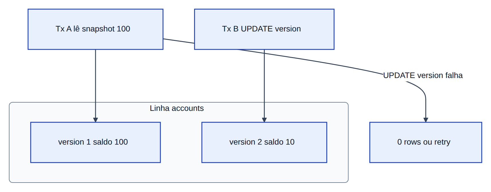
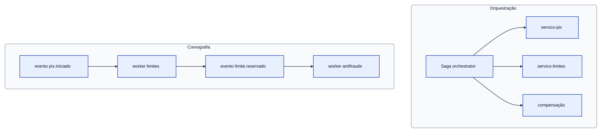
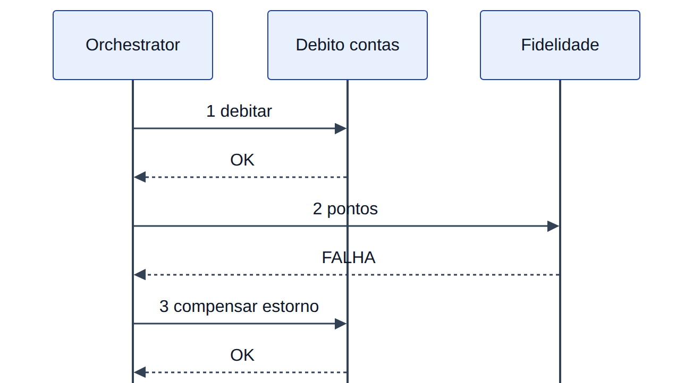
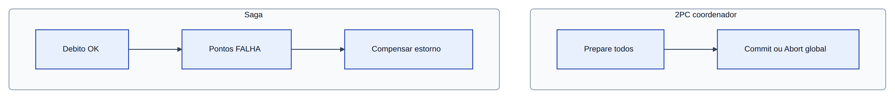
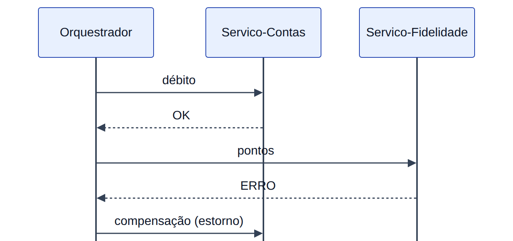
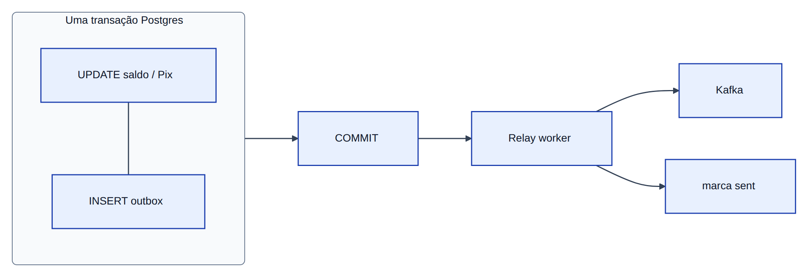

# Módulo 4 — Concorrência, idempotência e sagas

**Laboratório:** [04 — Redis, Postgres e idempotência](../labs/lab-04-redis-postgres-idempotencia.md)

## Quando o saldo não fecha

Dois cliques em “pagar” podem ler o mesmo saldo e ambos passar — impossível num ledger. **Concorrência** é disputa no mesmo recurso; **consistência** é o livro fechar. Num PostgreSQL há um caderno; entre *Pix* e *Limites* são cadernos distintos. Em microsserviços, o problema se multiplica: não existe uma única transação SQL abrangendo *Pix*, *Limites* e antifraude. Cada serviço tem seu banco; a **consistência** torna-se um desenho explícito de locks, idempotência e, quando necessário, **sagas** com compensação.

Este capítulo conecta **Redis**, **PostgreSQL** e **Kafka** ao fluxo do *Pix* que você já opera no lab.

> **Figuras:** MVCC/isolamento · saga estilos · orquestração · outbox · 2PC vs saga.

## Cenário no laboratório

O *servico-pix* já envia o cabeçalho `Idempotency-Key`; falta **persistir** o estado da operação e proteger saldos contra corrida. Você demonstrará o furo sem controle, corrigirá com lock otimista ou pessimista e garantirá que replays HTTP e mensagens Kafka duplicadas não gerem efeito em dobro.

## Concorrência e a ilusão do snapshot

Duas transações leem saldo 100 antes de qualquer escrita; ambas aprovam débito de 90; o saldo final deveria ser 10, mas o sistema registra -80. Isso é **condição de corrida** — não bug de sintaxe, bug de **modelo de isolamento**.

### ACID em um banco vs BASE entre serviços

Num PostgreSQL, **ACID** significa: tudo da transação passa junto ou nada passa (**atomicidade**), regras de negócio respeitadas (**consistência**), transações simultâneas não se atropelam de forma errada (**isolamento**), sobrevive a reinício (**durabilidade**).

Entre *Pix* e *Limites* não existe `BEGIN` único. O padrão é **BASE**:

- **Basically Available** — portas continuam atendendo mesmo com partes degradadas.
- **Soft State** — o saldo que você lê pode estar um instante desatualizado até a fila processar (estado “mole”, não mentira intencional).
- **Eventual Consistency** — depois dos eventos e retries, os cadernos convergem.

Há acordos explícitos (outbox, idempotência, compensação), não um único botão “commit global”.

## Isolamento no PostgreSQL: níveis e anomalias



Dentro de um banco, **isolamento** define o que uma transação “enxerga” de outras simultâneas. O PostgreSQL implementa **MVCC** (*Multi-Version Concurrency Control*): leituras veem um **snapshot** consistente; escritas criam novas versões de linha; versões antigas são limpas pelo **VACUUM**.

| Nível SQL | Anomalia evitada | O que ainda pode acontecer |
|-----------|------------------|----------------------------|
| **READ UNCOMMITTED** | — (no PG equivale a READ COMMITTED) | Dirty read (não no PG) |
| **READ COMMITTED** | Dirty read | Non-repeatable read, phantom |
| **REPEATABLE READ** | Non-repeatable read | Phantom (parcialmente no PG) |
| **SERIALIZABLE** | Phantom (via SSI no PG) | Mais aborts por conflito |

| Anomalia | Cenário *Pix* |
|----------|----------------|
| **Dirty read** | Ler saldo que outra transação ainda não confirmou |
| **Non-repeatable read** | Ler saldo 100, outra transação debita, ler 10 na mesma transação |
| **Phantom read** | `SELECT COUNT(*)` de débitos do dia muda porque outra transação inseriu linha |
| **Write skew** | Duas transações leem regras compatíveis separadamente e escrevem juntas violando invariante global (ex.: dois limites diários em contas diferentes que somados estouram política) |

**Write skew** não é resolvido só com lock na linha — precisa lock em **intervalo** (`SELECT … FOR UPDATE` na faixa relevante) ou **SERIALIZABLE**.

### MVCC na prática

- Leitores não bloqueiam escritores (snapshot).
- `UPDATE` concorrente na mesma linha: uma ganha, outra espera ou falha.
- Coluna `version` no lock otimista é camada de aplicação **sobre** MVCC — `UPDATE … WHERE version = ?` detecta conflito sem segurar linha o tempo todo.

## Lock otimista: versão como juiz

Como editar planilha com número de revisão: só grava quem ainda vê a mesma revisão. Adicione coluna `version` à conta:

```sql
UPDATE accounts SET balance = balance - 90, version = version + 1
WHERE id = ? AND version = ?;
```

Se nenhuma linha for afetada, outra transação ganhou — retorne conflito (`409`) ou retry controlado. Funciona bem quando conflitos são **raros** e você quer throughput.

## Lock pessimista: segurança na transação

`SELECT ... FOR UPDATE` tranca a fila do caixa até terminar o atendimento (**COMMIT** no SQL). Ninguém mexe no saldo naquela janela. Mais seguro, menos paralelismo — comum quando a mesma conta recebe muitos *Pix* por segundo.

`SELECT … FOR UPDATE SKIP LOCKED` permite filas de trabalho: pega a próxima linha livre sem esperar — útil em workers, não no débito da mesma conta simultâneo sem desenho cuidadoso.

## Idempotência: a mesma chave, o mesmo efeito

**Idempotência** garante que repetir a mesma operação identificada não duplica efeito. O cliente envia `Idempotency-Key: uuid` no *Pix*.

Implementações comuns (não reduza idempotência só a Redis):

| Mecanismo | Uso |
|-----------|-----|
| **Redis `SET NX`** | “Só cria se não existir” — cache rápido da resposta por chave |
| **Unique constraint** (Postgres) | Banco recusa segunda linha com mesma `idempotency_key` |
| **Inbox / dedup table** | Tabela “já processei mensagem X” no consumer Kafka |
| **Event store** | Histórico de eventos imutáveis (cada mudança é registro novo) |
| **Kafka EOS** | *Exactly-once* no Kafka — exige produtor transacional + desenho cuidadoso |

Fluxo no **repositório** (`apps/servico-pix/app/idempotency.py`):

| Passo | Onde |
|-------|------|
| Ler cache | `get_cached_response` — Redis `idempotency:{key}` e/ou linha em `idempotency_records` |
| Processar | `process_pix` se não houver cache |
| Persistir | `store_response` — Redis com TTL 86400 s + `IdempotencyRecord` (PK na chave) |
| Replay HTTP | `main.py` devolve corpo anterior com `idempotent_replay: true` |

Padrão alternativo com `SET idempotency:<key> PROCESSING NX` (estado intermediário) é comum em outros bancos; aqui a resposta final gravada **é** o contrato de idempotência. Em APIs de pagamento isso não é opcional — protege retry de cliente, timeout e duplo clique.

## Idempotência com Kafka

Kafka entrega **at-least-once** na prática: a mesma mensagem `pix.iniciado` pode ser processada duas vezes. O consumer deve deduplicar pela `idempotency_key` do payload (`SETNX` no Redis ou chave natural no Postgres) **antes** de aplicar efeito colateral — notificação, pontos, projeção de saldo.

## Sagas: passos locais e compensação

**Saga** é fluxo em várias salas sem transação global: débito OK → pontos falha → **compensação** (estorno) no débito. Não existe “desfazer” mágico — em banco faz-se lançamento reverso (**ledger** imutável: nunca apague, sempre compense).

| Estilo | Como funciona |
|--------|----------------|
| **Orquestrada** | Um “maestro” (serviço coordenador) manda fazer e desfazer passos |
| **Coreografada** | Cada serviço ouve evento e publica o próximo — sem centro único |

Exemplo narrativo: débito em contas OK → pontos em fidelidade falha → **estorno** em contas com lançamento reverso no ledger. Prefira **ledger imutável** (novos lançamentos) a apagar histórico — auditoria e regulatório agradecem.





### 2PC vs saga: transações distribuídas reais



**Two-Phase Commit (2PC)** é o protocolo clássico de transação distribuída:

1. **Prepare**: coordenador pergunta a todos os participantes “consegue commitar?”
2. **Commit** ou **Abort**: se todos disseram sim, commit global; senão, abort.

| | 2PC | Saga |
|---|-----|------|
| Consistência imediata | Forte (se completar) | Eventual entre passos |
| Bloqueio | Participantes seguram locks na fase prepare | Passos locais curtos |
| Falha do coordenador | Bloqueio até recuperação | Compensação explícita |
| Uso em microsserviços | Raro (XA/JTA legado) | Padrão dominante |

Em microsserviços financeiros, **2PC entre *Pix* e *Limites*** é frágil (latência, indisponibilidade parcial, acoplamento). Prefira **saga** + **outbox** + **idempotência**. 2PC ainda aparece **dentro** de um cluster (Postgres + outbox na mesma transação) — não entre dez HTTPs.

### Consistência causal e leitura

**Consistência causal**: se evento A causou B, todo leitor que vir B deve poder ver A. Kafka com mesma chave na mesma partição preserva ordem causal **por conta**. Entre tópicos diferentes, use **version vectors** ou timestamps de negócio no payload — não confie só no relógio do servidor.

**Read-your-writes**: após o *Pix* gravar, a consulta de saldo do mesmo usuário deve ir ao primário ou esperar projeção — senão o app mostra saldo antigo (“cadê meu dinheiro?”).

### Aprofundamento: o que o lab não simplifica

| Tópico | Risco real |
|---------|------------|
| **Compensação não determinística** | Estorno parcial, taxa já cobrada, antifraude irreversível |
| **Saga timeout** | Passo pendente vira transação órfã |
| **Orphan transactions** | Coordenador cai no meio da orquestração |
| **Semantic rollback** | “Desfazer” não restaura estado de negócio (ex.: notificação já enviada) |
| **Pivot transaction** | Ponto após o qual compensação muda de regra |



## Transactional outbox: DB e fila alinhados

Cenário ruim: Postgres grava o *Pix*, o processo cai antes de publicar no Kafka — o dinheiro “foi”, o evento não. **Outbox**: na **mesma transação SQL**, grava negócio + linha na tabela `outbox`. Um **relay** (worker separado, no lab `worker-outbox-relay`) lê a tabela e publica no Kafka — como registrar a carta no livro caixa e o carteiro buscar depois.



O Módulo 7 aprofunda outbox e DLQ; aqui você entende por que o *Pix* não deve bloquear a resposta HTTP com **publish síncrono** ao broker como destino final do fluxo crítico.

## Trade-offs

| Escolha | Ganho | Custo |
|---------|-------|-------|
| Lock pessimista | Correção forte no saldo | Menos throughput na mesma conta |
| Lock otimista | Throughput em baixa contenção | Retries e conflitos `409` |
| Saga coreografada | Desacoplamento | Depuração difícil sem tracing |
| Saga orquestrada | Visibilidade central | Ponto único de falha no orchestrator |
| Outbox | Consistência DB + evento | Complexidade de relay e monitoração |

## Anti-patterns

- Publicar no Kafka **antes** do commit no Postgres.
- Compensação que apaga histórico em vez de lançamento reverso.
- Saga longa com dezenas de passos síncronos HTTP.
- Idempotência só no edge, ausente no consumer.

## Quando NÃO usar

- **Saga:** fluxo cabe numa transação local ou um único serviço.
- **Outbox:** volume baixo e perda ocasional de evento é aceitável (raro em pagamentos).
- **Redis para idempotência:** sem TTL e persistência alinhada ao negócio.

## Produção real

- **Schema Registry** (Avro/Protobuf) para evolução de eventos `pix.iniciado`.
- **DLQ** para poison messages após N tentativas.
- Monitorar **lag** e tamanho da outbox não publicada.

## Troubleshooting

| Sintoma | Investigação |
|---------|--------------|
| Saldo divergente | Isolamento, lock, duplicidade de consumer |
| Evento não chegou | Tabela outbox, relay parado, ACL Kafka |
| Compensação falhou | Log de saga, estado órfão, timeout |

## Exercícios

1. Reproduza corrida de saldo sem lock; depois com `version`.
2. Reenvie mesmo `Idempotency-Key` e prove mesma resposta.
3. Desenhe compensação para “pontos falharam após débito”.

## Em resumo

Consistência em microsserviços é engenharia explícita: locks para saldo, idempotência para HTTP e fila, sagas para fluxos multi-serviço, outbox para não perder eventos. O laboratório mostra o furo e a correção com dados reais no *kind*.

## Leitura complementar

- [Transactional outbox](https://microservices.io/patterns/data/transactional-outbox.html)
- [Saga pattern](https://microservices.io/patterns/data/saga.html)
