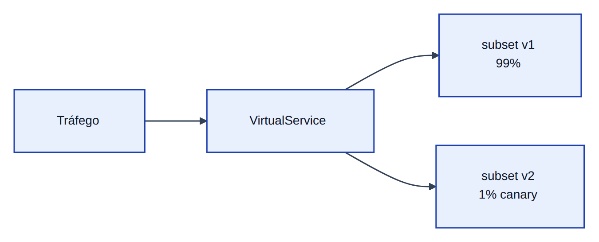
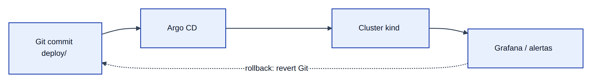

# Módulo 5 — Deploy, roteamento avançado e GitOps

**Laboratório:** [05 — Canary e GitOps](../labs/lab-05-canary-gitops.md)

> **Figuras:** canary por peso · loop GitOps (reconciliação).

## Mudança sem medo (ou com medo calculado)

**Canary** expõe uma fração do tráfego à versão nova; **mirror** copia tráfego para teste sem mudar a resposta ao cliente — como testar prato em uma mesa antes do cardápio inteiro.

Subir *servico-credito* **v2** não pode expor 100 % dos clientes a regressão. Ao mesmo tempo, deploy manual via `kubectl edit` não escala nem audita bem. Este capítulo une **estratégias de release** no Istio (canary, mirror) com **GitOps**: o cluster reflete o que está versionado no Git.

## Cenário no laboratório

O repositório expõe *credito* com `SERVICE_VERSION` (`v1` / `v2`). Você criará subsets no mesh, desviará uma fração do tráfego para v2, opcionalmente espelhará tráfego para testar carga sem impactar resposta ao cliente e praticará rollback via Git ou pesos no `VirtualService`.

## Kubernetes como runtime de deploy

| Objeto | O que é |
|--------|---------|
| **Pod** | Um ou mais containers rodando juntos (a “caixa” mínima) |
| **Deployment** | “Quero 3 cópias desta imagem”; faz **rolling update** trocando aos poucos |
| **Service** | Nome DNS fixo (`servico-credito`) que aponta para os pods certos, mesmo quando IPs mudam |

**Rolling update** troca réplicas sem derrubar todas de uma vez. **Recreate** derruba tudo e sobe de novo — janela de indisponibilidade; raro em API crítica.

## Canary: progressão com evidência

**Canary** envia uma **pequena fração** do tráfego para a versão nova enquanto a maioria permanece na estável. Você observa erro, latência e consumo; aumenta peso (1 % → 10 % → 50 %) ou reverte.

No Istio, `VirtualService` com pesos entre subsets:

```yaml
http:
  - route:
      - destination: { host: servico-credito, subset: v1 }
        weight: 99
      - destination: { host: servico-credito, subset: v2 }
        weight: 1
```

**DestinationRule** diz ao Istio quais pods são “v1” ou “v2” (por **labels** — etiquetas no pod).



Critérios de promoção devem ser **objetivos**: “taxa de erro v2 &lt; 0,1 % por 30 min”, não “parece ok”.

## Traffic mirroring (shadow)

**Mirror** envia cópia assíncrona do tráfego para v2; a resposta ao cliente vem só de v1. v2 pode falhar, ser lento ou consumir CPU — **o cliente não observa impacto na resposta**. Ideal para validar comportamento sob carga real antes do canary de resposta.

## Roteamento por header e blue-green

Canary por header (`x-canary: true`) limita exposição à equipe interna. **Blue-green** mantém dois ambientes completos e troca tráfego de uma vez — simplicidade operacional, mudança brusca; canary é mais gradual.

## GitOps: Git como fonte da verdade

**GitOps**: o que está no Git é o que o cluster deve ter. **Argo CD** (operador) compara cluster real com Git e corrige diferença (**drift** — alguém mudou na mão com `kubectl edit`). **OutOfSync** no Argo significa “cluster diferente do repositório”.



Benefícios: auditoria por histórico Git, rollback = revert, mesmo fluxo em ambientes, revisão por pull request de manifests.

### GitOps leve no lab

Sem Argo, `kubectl apply -k deploy/k8s` a partir do monorepo já ensina reprodutibilidade declarativa. Argo é o passo seguinte quando você quer UI e detecção contínua de drift (laboratório do Módulo 5).

## Kubernetes em produção (além do lab)

| Recurso | O que é |
|---------|---------|
| **HPA** (*Horizontal Pod Autoscaler*) | Se a fila do caixa cresce (CPU alta), o Kubernetes abre mais guichês (réplicas) — e fecha quando a fila esvazia |
| **PDB** (*Pod Disruption Budget*) | Durante reforma do prédio (manutenção de nó), garante que pelo menos N guichês continuam atendendo |
| **Readiness probe** | O guichê só recebe cliente depois que o sistema interno respondeu “pronto” no `/healthz` |
| **Liveness probe** | Se o atendente travou de vez, o Kubernetes troca o pod por outro |
| **Graceful shutdown** | Aviso de “fechando em 30 s” (`preStop`) para terminar quem já está na fila antes de desligar |
| **Requests/limits** | Reserva mínima e teto máximo de CPU/RAM — evita um container comer o servidor inteiro |
| **Taints/tolerations** | Etiqueta “só funcionários autorizados neste andar” — pods sem tolerância não sobem naquele nó |

## Trade-offs

| Estratégia | Prós | Contras |
|------------|------|---------|
| Canary | Exposição gradual | Exige métricas confiáveis |
| Blue-green | Rollback rápido | Dobro de capacidade temporária |
| GitOps | Auditoria, drift visível | Curva Argo CD / flux |
| Mirror | Teste com tráfego real | Custo de processamento duplicado |

## Quando NÃO usar

- **Canary:** sem métricas de erro/latência por versão.
- **Mirror:** v2 com efeitos colaterais (escrita em DB) sem isolamento.
- **GitOps pesado:** time único, cluster descartável só para estudo.

## Anti-patterns

- Promover canary “por feeling”.
- `image: latest` em produção (Kyverno deve bloquear).
- Deploy sem probes — Kubernetes não sabe se o pod está saudável.

## Produção real

- Custo operacional de Argo + revisão de PR em manifests.
- **Platform engineering:** golden path para novo serviço (Módulo 6).

## Troubleshooting

| Sintoma | Ação |
|---------|------|
| Tráfego não chega na v2 | Subset labels, pesos VS, DestinationRule |
| Argo OutOfSync | Drift manual; diff no UI |
| Rollback lento | Git revert + sync vs só peso 0 na v2 |

## Exercícios

1. Canary 1% com v2 retornando 500 — alerta e rollback.
2. Documente critério objetivo de promoção (erro &lt; 0,1 % por 30 min).
3. Simule deploy sem `resources.limits` — política Kyverno (lab 07d).

## Em resumo

Entrega segura combina **roteamento fino** no mesh com **processo** versionado. O laboratório implementa subsets, canary e, se possível, mirror; simula falha na v2 e executa rollback documentado.

## Leitura complementar

- [Argo CD](https://argo-cd.readthedocs.io/)
- [Istio — Traffic management](https://istio.io/latest/docs/concepts/traffic-management/)
