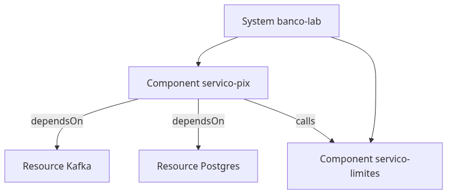
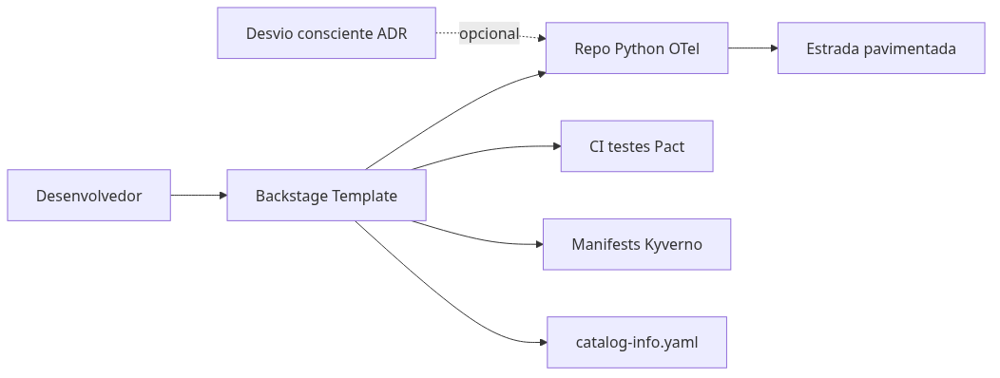

# Módulo 6 — Developer experience (Backstage)

**Laboratório:** [06 — Backstage e catálogo](../labs/lab-06-backstage-catalogo.md)

## O mapa que falta no monorepo

**Backstage** é o mapa do sistema: dono de cada serviço, dependências, documentação. “Quem mantém o *servico-pix*?” ou “o que quebra se o Kafka cair?” não deveria depender de mensagem no chat.

O **Software Catalog** cadastra componentes em YAML (*Pix*, Kafka, Postgres). **TechDocs** renderiza Markdown do repositório na interface. **Software Templates** criam novo serviço já com padrão (Dockerfile, health check, catálogo) — “receita de bolo” da plataforma.

Este capítulo usa `catalog-info.yaml` e `catalog-entities.yaml` do lab.

## Por que catálogo importa em bancos digitais

Regulatório e auditoria pedem rastreabilidade: qual sistema processa dados de pagamento, quem mantém, qual API expõe. Sem catálogo, cada repositório é uma ilha; onboarding demora semanas; incidentes perdem tempo descobrindo dependências. Um catálogo bem mantido é **infraestrutura de colaboração**, não burocracia.

## Entidades do Software Catalog



| Entidade | Significado no lab |
|----------|-------------------|
| **System** | `banco-lab` — conjunto coerente do estudo |
| **Component** | `servico-pix`, `servico-limites`, `servico-credito` |
| **API** | OpenAPI exposta pelo *Pix* |
| **Resource** | Kafka, Postgres (quando modelados) |

Cada entidade é descrita em YAML (formato Backstage) ou descoberta por integrações. Campos como `owner` e `lifecycle` (`experimental`, `production`) orientam governança e escalação.

### Location: ponto de entrada

Um arquivo `Location` aponta para outros descritores:

```yaml
apiVersion: backstage.io/v1alpha1
kind: Location
metadata:
  name: financial-applications
spec:
  targets:
    - ./catalog-entities.yaml
```

Assim o catálogo importa o grafo de componentes do monorepo de laboratório.

## TechDocs: documentação ao lado do código

**TechDocs** renderiza Markdown do repositório (via `mkdocs.yml`) dentro do Backstage. O desenvolvedor lê o runbook onde já está o componente — não num wiki desatualizado. Neste projeto, `modulos/` e labs podem alimentar a aba Docs após configuração.

## Software Templates: o golden path

**Templates** guiam criação de novos serviços: nome, squad, linguagem → repositório com Dockerfile, CI, health check, `catalog-info.yaml`, instrumentação OTel padrão. Passos típicos: `fetch:template` → `publish:github` → `catalog:register`.

O objetivo é reduzir **snowflake**: menos “cada time inventa um jeito de fazer Pix”. Mais conformidade por padrão.

## Relação com a Onda 7 da espinha dorsal

Registrar o sistema de laboratório no catálogo fecha a narrativa da plataforma: não basta subir pods no *kind*; é preciso **nomear**, **relacionar** e **documentar** o que foi construído. Opcionalmente, TechDocs aponta para este livro e para os laboratórios.

## Platform engineering: além do catálogo



**Platform engineering** é construir e operar uma **Internal Developer Platform (IDP)** — o “shopping” interno onde times de produto provisionam serviços, pipelines e observabilidade sem reinventar Kubernetes a cada sprint.

### Golden paths e paved roads

| Conceito | Significado | No lab |
|----------|-------------|--------|
| **Golden path** | Caminho recomendado e suportado pela plataforma | Template Python + OTel + `catalog-info.yaml` + manifests Kyverno-ready |
| **Paved road** | Mesma ideia, ênfase em “estrada já asfaltada” | `docker-compose` → *kind* → Istio → labs 07 |
| **Desvio consciente** | Snowflake permitido com ADR e dono | Serviço Go fora do template — documentado no catálogo |

Golden path não proíbe exceção; **reduz** serviços órfãos sem CI, sem SLO e sem dono.

### Self-service e software templates

**Self-service**: desenvolvedor clica “criar serviço *Pix*-like” no Backstage → repositório, pipeline, namespace, secrets pattern, dashboard Grafana base — sem ticket de duas semanas para infra.

**Software Templates** (Backstage Scaffolder) encadeiam ações:

1. `fetch:template` — copia esqueleto
2. `publish:github` — cria repo
3. `catalog:register` — entra no grafo
4. (opcional) `create:kubernetes-namespace`

O template é código versionado — evolui como produto.

### Platform as a Product

Trate a plataforma como produto com **clientes internos** (desenvolvedores):

- backlog priorizado por dor real (deploy lento, falta de sandbox);
- **SLA** da plataforma (“novo cluster em 1 dia”);
- pesquisas de satisfação (SPACE, DORA como métricas de entrega);
- documentação que funciona (TechDocs, não PDF morto).

### Scorecards e governança leve

**Scorecards** no Backstage (plugins como `backstage-plugin-tech-insights`) avaliam maturidade por componente:

| Critério | Por que importa em banco |
|----------|--------------------------|
| Owner definido | Escalonamento em incidente |
| SLO documentado | Error budget (Módulo 2) |
| CI com testes + Pact | Contrato quebrado antes de produção |
| Imagem sem `:latest` | Reprodutibilidade |
| PII scrub em traces | LGPD (Módulo 7) |

Scorecard **não** é auditoria punitiva — é visibilidade para priorizar débito técnico.

### Team Topologies (ligação organizacional)

| Tipo de time | Papel |
|--------------|-------|
| **Stream-aligned** | Entrega *Pix*, contas — consome a plataforma |
| **Platform** | IDP, clusters, golden paths — habilita streams |
| **Enabling** | Coaches temporários (observabilidade, Kafka) |
| **Complicated-subsystem** | Especialistas (antifraude, core legado) |

Backstage reflete essa estrutura: `owner: squad-pix` no `catalog-info.yaml` alinha catálogo à escalação.

## Trade-offs

| Prós | Contras |
|------|---------|
| Onboarding mais rápido | Manutenção do catálogo e plugins |
| Visibilidade de dependências | Catálogo desatualizado vira mentira |

## Quando NÃO usar

- Um único repositório, três serviços, time de uma pessoa — README + diagrama podem bastar.
- Backstage sem dono dedicado — vira wiki morta.

## Anti-patterns

- `owner: unknown` em todos os componentes.
- TechDocs desatualizado em relação ao `labs/`.

## Exercícios

1. Adicione dependência `dependsOn` de *Pix* → Kafka no `catalog-entities.yaml`.
2. Esboce Software Template com health check + OTel + Kyverno-ready manifests.

## Em resumo

Backstage não substitui Kubernetes nem Istio; dá **contexto humano** ao que você deployou. O laboratório importa o catálogo, explora dependências entre *Pix*, *Limites* e *Crédito* e, se desejar, esboça um template mínimo para novos serviços Python.

## Leitura complementar

- [Backstage — Software Catalog](https://backstage.io/docs/features/software-catalog/)
- [Descriptor format](https://backstage.io/docs/features/software-catalog/descriptor-format)
