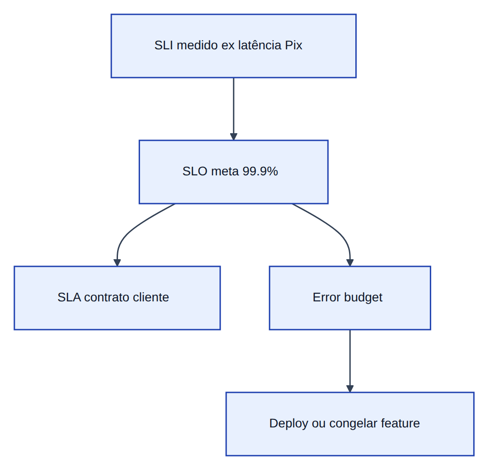
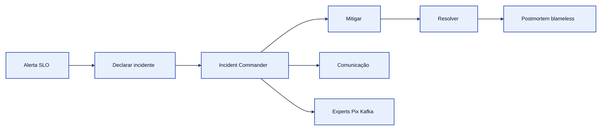
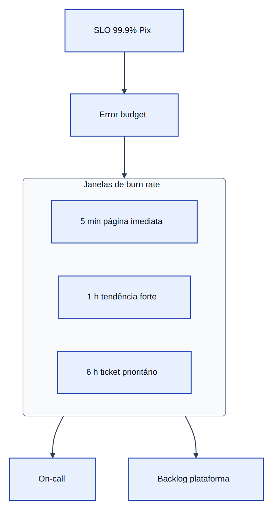

# Módulo 7 — Operação segura, integridade de dados e conformidade

**Laboratórios:** [07a Segredos](../labs/lab-07a-segredos-external-secrets.md) · [07b Outbox](../labs/lab-07b-outbox-kafka.md) · [07c Pact](../labs/lab-07c-pact-contratos.md) · [07d Kyverno](../labs/lab-07d-kyverno-admission.md) · [07e DR](../labs/lab-07e-disaster-recovery.md) · [07f PII](../labs/lab-07f-pii-observabilidade.md)

## Do laboratório à defesa em produção

No *kind*, “funcionou” basta. Em produção e auditoria entram: senha fora do Git (**07a**), mensagem duplicada sem efeito duplo (**07b** outbox), contrato testado no CI (**07c** Pact), YAML perigoso barrado (**07d** Kyverno), restore ensaiado (**07e** RPO/RTO), CPF fora de trace (**07f**).

O cenário que **funciona** precisa **se defender** quando alguém erra, credencial vaza ou deploy quebra consumidor silenciosamente.

Trate este bloco como duas a quatro semanas **depois** de consolidar os módulos 1–6 no cluster — reforço transversal, não atalho.

## 7.1 Segredos e rotação

Senha no Git é como colar a chave do cofre no mural da agência: mesmo que apague depois, alguém fotografou no histórico. `Secret` do Kubernetes em base64 é só **encoding** — texto disfarçado, não criptografia forte nem cofre.

| Abordagem | O que é |
|-----------|---------|
| **Vault** | Cofre com senha mestra, auditoria de quem leu o quê e troca programada de chaves |
| **Cloud Secret Manager** | Mesmo conceito, operado pela nuvem (AWS/GCP/Azure) |
| **External Secrets Operator** | Mensageiro: lê do cofre e entrega um `Secret` no cluster sem você copiar na mão |

**Rotação** é trocar a fechadura periodicamente: atualiza no cofre, o operador sincroniza, os pods reiniciam em **rolling update** (um de cada vez). **Least privilege** (*menor privilégio*) é dar a cada serviço só a chave da sua gaveta — no Kubernetes isso é **RBAC** (quem pode ler qual `Secret` e em qual namespace).

O laboratório 07a remove segredos versionados e pratica External Secrets ou equivalente documentado.

## 7.2 Filas, at-least-once e outbox

Pense no correio entre salas:

| Semântica | Na prática |
|-----------|------------|
| **At-most-once** | Pode perder a carta — raro em dinheiro |
| **At-least-once** | A carta pode chegar duas vezes — comum no Kafka; o consumer precisa reconhecer “já li esta” |
| **Exactly-once** | Efeito de negócio uma vez só — na prática combina transação local + idempotência, não um botão mágico do broker |

**Outbox** (lab 07b): na mesma transação do Postgres você grava o *Pix* **e** uma linha “carta a enviar”; um **relay** (carteiro separado) publica no Kafka. Se o *Pix* foi gravado, a carta não se perde — mesmo que o HTTP já tenha respondido ao cliente.

No monorepo: `pix_service.py` grava `PixTransfer` + `OutboxEvent`; `apps/worker-outbox-relay/` publica com `FOR UPDATE SKIP LOCKED` e span `outbox.publish`. Ative com `DATABASE_URL` + `PIX_USE_OUTBOX=true` (evite `PIX_SYNC_KAFKA=true` no fluxo principal).

**DLQ** (*dead letter queue*) é a gaveta de “cartas com endereço inválido”: depois de N tentativas, a mensagem sai da fila principal para não travar o resto nem esconder o erro num loop infinito.

## 7.3 Testes de contrato (Pact)

*Pix* (consumidor) espera JSON com certos campos; *Limites* (provedor) renomeia `daily_remaining` para `remaining` — em produção o *Pix* quebra na madrugada.

**Pact** é o combinado escrito antes da festa: o consumidor diz “vou pedir GET `/v1/limits/acc_demo` e espero estes campos”; o CI do provedor roda contra esse arquivo e falha se a API mudar sem combinar. Você testa o encaixe das peças sem subir o banco inteiro em cada commit.

Laboratório 07c implementa consumidor, gera pact file e pipeline de verificação.

## 7.4 Admission policies (Kyverno / Gatekeeper)

**Admission controller** é o porteiro da portaria do cluster: todo `kubectl apply` passa por ele **antes** de virar pod rodando. O estado desejado fica no **etcd** (caderno central do Kubernetes — quem roda onde, com qual imagem).

**Kyverno** escreve regras em YAML legível (“em `core-banking`, Deployment sem `resources.limits` é barrado”). **Gatekeeper** faz o mesmo tipo de trabalho com **Rego** (linguagem de política mais expressiva, curva maior).

Políticas úteis no lab:

- Obrigar `resources.limits` em `core-banking`
- Proibir imagem `:latest`
- Exigir `runAsNonRoot` onde viável

Manifest “ruim” deve ser **negado** com mensagem clara — prova para auditoria de que o cluster não aceita deploy descuidado. O repositório inclui exemplo em `deploy/policies/kyverno/`.

## 7.5 Disaster recovery: RPO e RTO

Incêndio no datacenter: duas perguntas de negócio viram siglas.

| Sigla | Pergunta | Analogia |
|-------|----------|----------|
| **RTO** (*Recovery Time Objective*) | Em quanto tempo o *Pix* volta? | Quanto tempo até reabrir o balcão depois do incêndio |
| **RPO** (*Recovery Point Objective*) | Quanto dado podemos perder? | O backup é de ontem ou de cinco minutos atrás — quantos *Pix* “sumiram” do livro |

Backup que nunca foi **restaurado** em teste é plano de incêndio só no papel. Lab 07e: restore do Postgres e cronometrar até o `curl` do lab 00 voltar verde.

## 7.6 Conformidade: LGPD, PCI e telemetria

**LGPD** trata dado pessoal como bem do titular: colete só o necessário, tenha base legal, não guarde CPF em log “porque sim”. Traces e logs não são arquivo morto do RH.

**PCI-DSS** entra quando **PAN** (número completo do cartão) circula no sistema — aí há regras rígidas de rede, criptografia e auditoria. Na prática, tokeniza (substitui por um ID que só o gateway de pagamento entende).

Técnicas no lab:

- Lista de campos proibidos em log/trace
- Processors *structlog* mascarando documentos
- OTel Collector removendo atributos sensíveis antes do Jaeger

Laboratório 07f revisa trace real sem PII.

## Encadeamento no monorepo

| Tópico | Onde praticar |
|--------|----------------|
| Segredos | `deploy/k8s/`, ExternalSecret |
| Outbox | `apps/servico-pix`, worker relay |
| Pact | `apps/servico-pix/tests/contract` |
| Políticas | `deploy/policies/kyverno` |
| DR | `docs/dr-runbook.md` |
| PII | apps + `deploy/observability/` |

## 7.7 SRE em produção: incidentes, alertas e cultura

O lab ensina ferramentas; **SRE** ensina como operar sob pressão com métricas de confiabilidade.

### Incident command e resposta

| Papel | Responsabilidade |
|-------|------------------|
| **Incident Commander (IC)** | Coordena, não debuga sozinho no canto |
| **Communications** | Status para negócio e clientes |
| **Subject Matter Expert** | Engenheiro que conhece *Pix* / Kafka |
| **Scribe** | Linha do tempo para postmortem |

Fluxo típico: detectar → declarar severidade → war room (Slack/Meet) → mitigar → resolver → **postmortem** em 48–72 h.

### Postmortem blameless

**Blameless** não significa “sem responsabilidade” — significa focar em **sistemas e processos**, não em culpar pessoa. Perguntas úteis:

- Por que o deploy passou sem Pact verde?
- Por que o alerta chegou 20 min depois do cliente?
- Que guardrail faltou (Kyverno, canary)?

Artefato: timeline UTC, impacto (R$ / clientes), causa raiz, ações com dono e prazo.

### Toil e alert fatigue

**Toil** (livro SRE): trabalho manual, repetitivo, escalável linearmente com tráfego — reiniciar pod à mão todo dia é toil; automatizar restart com probe correto não.

**Alert fatigue**: muitos alertas INFO disfarçados de página → on-call ignora tudo. Regras:

- página só em **sintoma** (SLO queimando), não em causa isolada (CPU 80 %);
- runbook linkado no alerta;
- **noisy alert** desligado ou rebaixado após 3 falsos positivos.

### Burn rate e multi-window alerting

SLO de 99,9 % no mês ainda permite “minutos ruins”. **Burn rate** mede **quão rápido** o error budget está sendo consumido.

| Janela | Uso |
|--------|-----|
| 5 min / 1 h | Incêndio agora — página |
| 6 h / 3 d | Tendência — ticket |

Prometheus (recording rules) ou Grafana SLO: alerte quando burn rate > 14× o budget sustentável — não quando “houve 1 erro”.

### SLI mal desenhado (anti-patterns)

| SLI ruim | Por quê | Melhor |
|----------|---------|--------|
| “Pods Running” | Pod up, app quebrada | Latência e erro do *Pix* |
| “CPU < 80 %” | Não mede cliente | RED do endpoint `/v1/pix` |
| “Kafka broker up” | Lag pode estar altíssimo | Consumer lag + tempo de processamento |
| “Logs sem ERROR” | ERROR pode estar desligado | Taxa 5xx + traces com tail sampling |

Ligue SLI ao **jornada do cliente** — débito confirmado, não apenas TCP estabelecido.

## Critério de conclusão do percurso

Espinha dorsal pronta **e** evidências dos laboratórios 07: segredos fora do Git, outbox no fluxo crítico, Pact no CI, duas políticas Kyverno ativas, restore Postgres ensaiado, trace sem dados proibidos. Opcional: gravação de 10–15 min percorrendo caos → trace limpo → política negando YAML → contrato verde.

## Capítulos transversais recomendados

| Tema | Onde praticar |
|------|----------------|
| **CQRS** | Escrever num caderno (comandos) e ler de outro otimizado para consulta — evita misturar “fazer *Pix*” com “extrato bonito” no mesmo modelo |
| **Event sourcing** | O livro não apaga linha: cada mudança vira evento; o saldo é reconstruído lendo a história |
| **Rate limiting / load shedding** | Porteiro limita entrada (Módulo 1) |
| **Chaos engineering** | Ensaiar incêndio controlado (*Toxiproxy*, broker fora) antes do incidente real |
| **Incident response / on-call** | Runbook DR 07e |
| **Error budgets** | SLO Módulo 2 |
| **Supply chain** | Imagem assinada, SBOM, scan no CI |

## Trade-offs operacionais

Ensinar Istio, Kafka e observabilidade completa sem falar **custo cognitivo**, **troubleshooting em camadas** e **overhead** induz expectativa irreal. Documente no README do time: o que é obrigatório no golden path vs opcional.

## Quando NÃO usar

- **Pact:** contrato estável, monólito, único consumidor.
- **Kyverno:** cluster descartável pessoal sem política corporativa.
- **Vault:** segredo estático de lab com rotação simulada.

## Exercícios integradores

Conclua a checklist da seção *Critério de conclusão* e grave 10–15 min: caos → trace sem PII → Kyverno negando YAML → Pact verde.

## Leitura complementar

- [External Secrets](https://external-secrets.io/)
- [Pact](https://docs.pact.io/)
- [Kyverno](https://kyverno.io/)
- [`REFERENCIAS.md`](../REFERENCIAS.md)
- Lei nº 13.709/2018 (LGPD)
